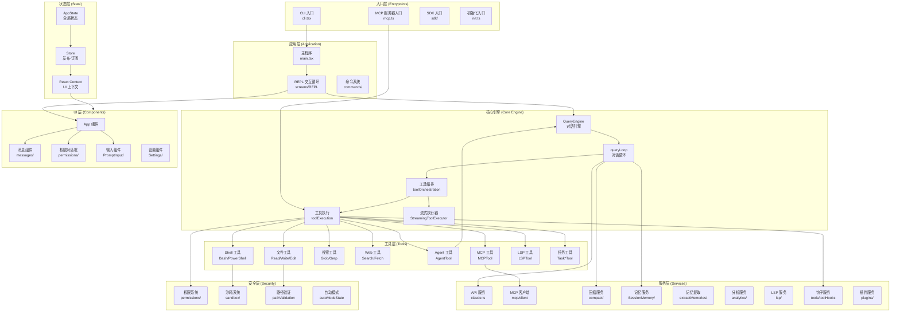
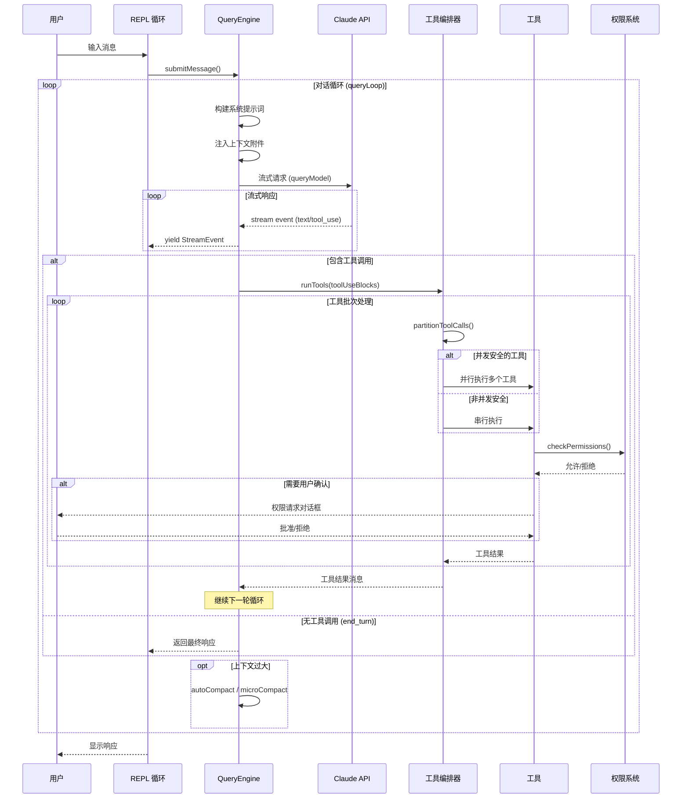
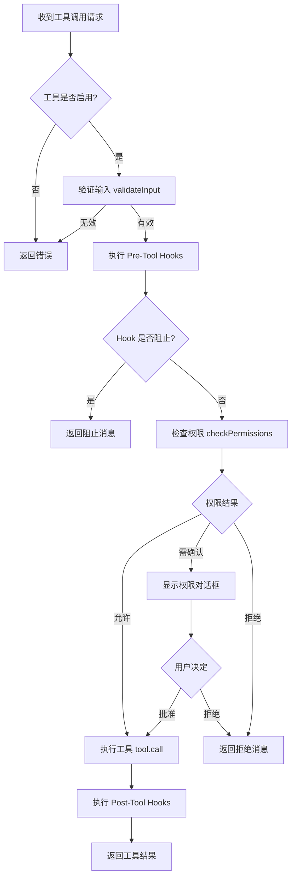
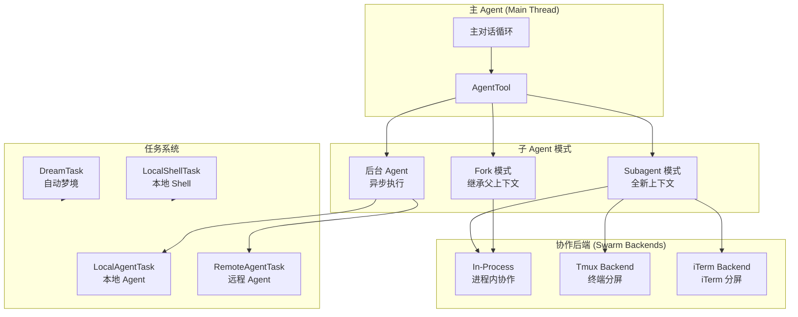
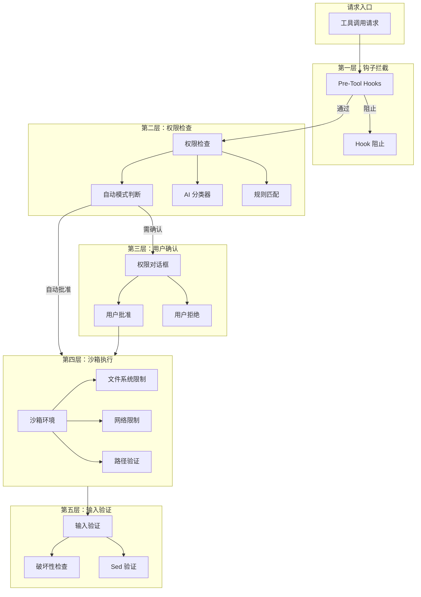
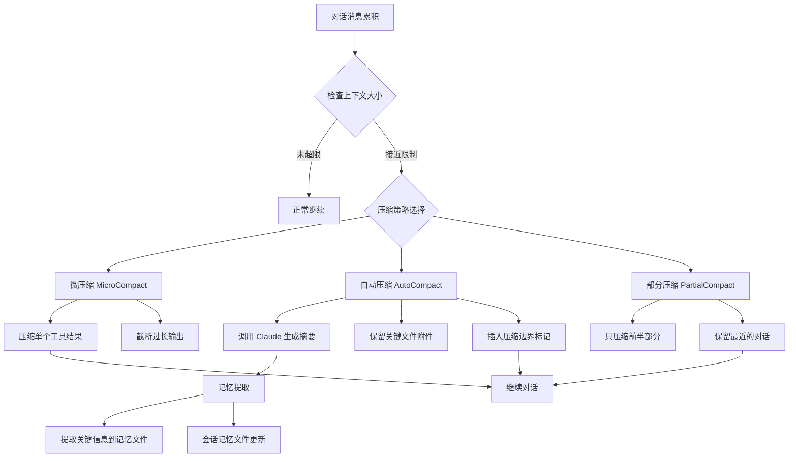
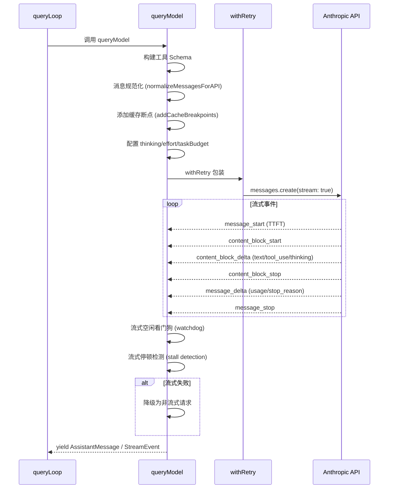
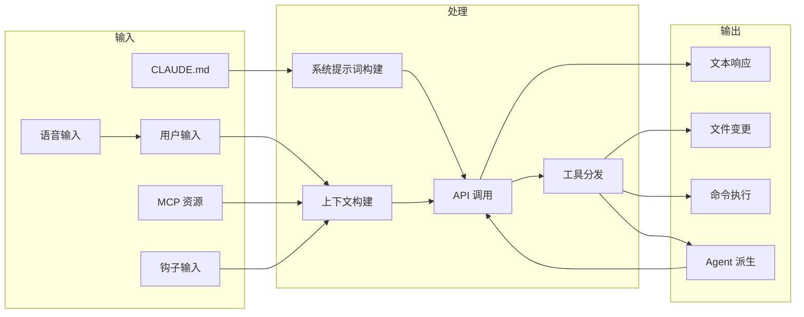

# Claude Code 源码解读：项目架构文档

## 技术栈概览

| 层面 | 技术 | 说明 |
|------|------|------|
| 运行时 | Bun | 高性能 JS/TS 运行时，支持 `bun:bundle` feature flag |
| 语言 | TypeScript | 全量 TS，Zod 做运行时 schema 校验 |
| 终端 UI | React + Ink | 基于 React 的终端渲染框架（自定义 96 文件） |
| API | Anthropic SDK | 流式 SSE 通信 |
| 协议 | MCP | Model Context Protocol 客户端/服务器 |
| 状态管理 | 自研 Store | 轻量发布-订阅模式（30 行实现） |

## 整体架构图



## 核心对话循环流程



## 工具执行流程



## 多 Agent 架构



## 安全架构



## 上下文管理流程



## API 调用流程



## 数据流向



## 目录结构说明

```
src/
├── entrypoints/          # 入口点：CLI、MCP 服务器、SDK
├── main.tsx              # 主程序入口，Commander 命令注册
├── screens/              # 屏幕组件（REPL 主界面）
├── components/           # React 组件（113 个 TSX 文件）
│   ├── messages/         # 消息渲染组件
│   ├── permissions/      # 权限对话框组件
│   ├── PromptInput/      # 输入框组件
│   └── ...
├── tools/                # 工具实现（40+ 个工具）
│   ├── BashTool/         # Shell 执行工具（18 文件）
│   ├── FileEditTool/     # 文件编辑工具
│   ├── AgentTool/        # Agent 派生工具（14 文件）
│   └── ...
├── services/             # 服务层
│   ├── api/              # Claude API 通信（claude.ts 3400 行）
│   ├── mcp/              # MCP 协议实现（client.ts 3200 行）
│   ├── compact/          # 上下文压缩
│   ├── SessionMemory/    # 会话记忆
│   ├── tools/            # 工具编排与执行
│   └── ...
├── state/                # 状态管理
├── utils/                # 工具函数（300+ 个文件）
│   ├── permissions/      # 权限工具（24 文件）
│   ├── sandbox/          # 沙箱工具
│   ├── swarm/            # 多 Agent 协作（22 文件）
│   ├── hooks.ts          # 钩子系统（5000+ 行）
│   ├── messages.ts       # 消息工具（5500+ 行）
│   ├── attachments.ts    # 附件系统（3200+ 行）
│   └── ...
├── ink/                  # 自定义终端 UI 引擎（96 文件）
├── commands/             # 斜杠命令（80+ 个）
├── hooks/                # React Hooks
├── skills/               # 技能系统
├── constants/            # 常量定义（prompts.ts 860 行）
├── bootstrap/            # 启动状态（state.ts 1755 行）
├── query.ts              # 查询循环核心（1500 行）
├── QueryEngine.ts        # 查询引擎
├── Tool.ts               # 工具基类定义（800 行）
└── tools.ts              # 工具注册
```


---

## 相关文档

- [01-项目整体说明](./01-项目整体说明.md) — 功能模块介绍、技术栈、项目规模
- [03-元提示词分析与借鉴](./03-元提示词分析与借鉴.md) — 提示词设计模式
- [04-架构设计思想与借鉴](./04-架构设计思想与借鉴.md) — 设计思想深度分析
- [05-项目优缺点分析](./05-项目优缺点分析.md) — 优缺点与改进建议
- [分模块源码解析](./readme/00-目录.md) — 13 个模块的详细源码解析
