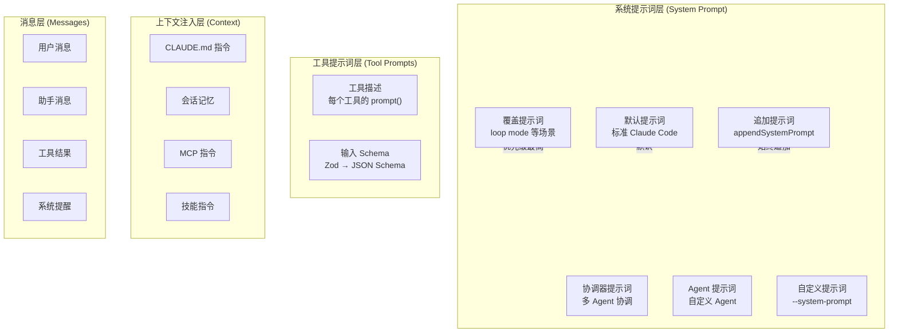
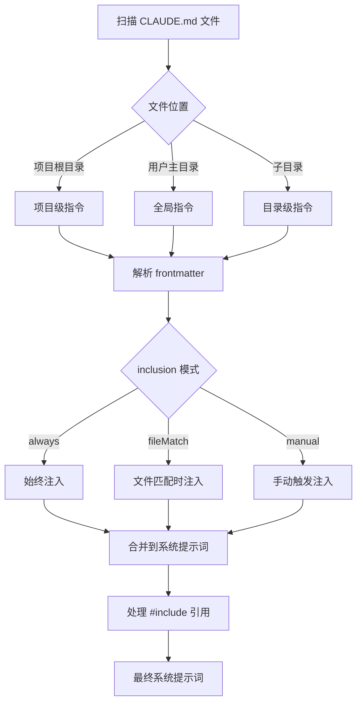

# Claude Code 源码解读：元提示词分析与借鉴

## 概述

Claude Code 的提示词工程是整个项目最值得学习的部分之一。它展示了一个工业级 AI 编程助手如何通过精心设计的提示词来引导 LLM 的行为。本文档深入分析其提示词设计模式，并提炼出可借鉴的经验。

## 一、提示词架构

### 1.1 多层提示词体系

Claude Code 的提示词不是一个单一的字符串，而是一个多层组合的体系：



### 1.2 提示词优先级

`buildEffectiveSystemPrompt` 函数定义了清晰的优先级：

1. **Override** → 完全替换（如 loop 模式）
2. **Coordinator** → 协调器模式专用
3. **Agent** → 自定义 Agent 提示词替换默认
4. **Custom** → 用户自定义替换默认
5. **Default** → 标准提示词
6. **Append** → 始终追加在末尾

## 二、工具提示词设计模式

### 2.1 BashTool 提示词分析

BashTool 的提示词是最复杂的，约 400 行，展示了多个关键设计模式：

#### 模式一：明确的工具偏好引导

```
IMPORTANT: Avoid using this tool to run cat, head, tail, sed, awk, or echo commands.
Instead, use the appropriate dedicated tool:
- File search: Use GlobTool (NOT find or ls)
- Content search: Use GrepTool (NOT grep or rg)
- Read files: Use Read (NOT cat/head/tail)
- Edit files: Use Edit (NOT sed/awk)
- Write files: Use Write (NOT echo >/cat <<EOF)
```

**借鉴点**：当系统有多个工具时，明确告诉 AI 什么场景用什么工具，用 NOT 强调不要用什么。

#### 模式二：结构化的操作指南

Git 操作指南使用了编号步骤 + 并行/串行标注：

```
1. Run the following bash commands in parallel:
   - Run a git status command...
   - Run a git diff command...
2. Analyze all staged changes and draft a commit message:
   - Summarize the nature of the changes...
3. Run the following commands in parallel:
   - Add relevant untracked files...
   - Create the commit...
```

**借鉴点**：对于复杂的多步骤操作，使用编号步骤，并明确标注哪些可以并行、哪些必须串行。

#### 模式三：安全红线（NEVER 规则）

```
Git Safety Protocol:
- NEVER update the git config
- NEVER run destructive git commands (push --force, reset --hard...) unless explicitly requested
- NEVER skip hooks (--no-verify) unless explicitly requested
- CRITICAL: Always create NEW commits rather than amending
```

**借鉴点**：对于危险操作，使用 NEVER + CRITICAL 等强调词，并给出明确的例外条件（"unless the user explicitly requests"）。

#### 模式四：沙箱约束的动态注入

```typescript
function getSimpleSandboxSection(): string {
  if (!SandboxManager.isSandboxingEnabled()) return ''
  // 动态生成沙箱限制描述
  const filesystemConfig = { read: {...}, write: {...} }
  const networkConfig = { allowedHosts: [...] }
  return `## Command sandbox
  The sandbox has the following restrictions:
  Filesystem: ${JSON.stringify(filesystemConfig)}
  Network: ${JSON.stringify(networkConfig)}`
}
```

**借鉴点**：提示词不是静态的，而是根据运行时环境动态生成。将实际的配置数据注入提示词中。

### 2.2 FileEditTool 提示词分析

```
- You must use your Read tool at least once before editing.
- When editing text from Read tool output, ensure you preserve the exact indentation.
- ALWAYS prefer editing existing files. NEVER write new files unless explicitly required.
- The edit will FAIL if old_string is not unique in the file.
```

**借鉴点**：
- 建立工具间的依赖关系（先 Read 再 Edit）
- 预防常见错误（缩进问题、唯一性问题）
- 用 FAIL 警告后果

### 2.3 AgentTool 提示词分析

AgentTool 的提示词最为精妙，展示了如何引导 AI 管理子 Agent：

#### 模式五：角色定义与行为约束

```
Brief the agent like a smart colleague who just walked into the room —
it hasn't seen this conversation, doesn't know what you've tried,
doesn't understand why this task matters.
```

**借鉴点**：用比喻来定义角色，让 AI 理解子 Agent 的上下文限制。

#### 模式六：反模式警告

```
**Never delegate understanding.** Don't write "based on your findings, fix the bug"
or "based on the research, implement it." Those phrases push synthesis onto the agent
instead of doing it yourself.
```

**借鉴点**：不仅告诉 AI 该做什么，还明确告诉它不该做什么，并解释为什么。

#### 模式七：示例驱动

```xml
<example>
user: "What's left on this branch before we can ship?"
assistant: <thinking>Forking this — it's a survey question.</thinking>
AgentTool({
  name: "ship-audit",
  prompt: "Audit what's left before this branch can ship..."
})
</example>
```

**借鉴点**：用完整的对话示例展示期望的行为模式，包括思考过程。

#### 模式八：Fork vs Subagent 的决策引导

```
Fork yourself (omit subagent_type) when the intermediate tool output
isn't worth keeping in your context.
- Research: fork open-ended questions.
- Implementation: prefer to fork implementation work.

**Don't peek.** The tool result includes an output_file path —
do not Read or tail it unless the user explicitly asks.

**Don't race.** After launching, you know nothing about what the fork found.
Never fabricate or predict fork results.
```

**借鉴点**：用简短有力的命令式短语（Don't peek, Don't race）来建立行为规则。

### 2.4 FileReadTool 提示词分析

```
Assume this tool is able to read all files on the machine.
If the User provides a path to a file assume that path is valid.
It is okay to read a file that does not exist; an error will be returned.
```

**借鉴点**：消除 AI 的"犹豫"——明确告诉它可以大胆尝试，错误会被优雅处理。

### 2.5 WebSearchTool 提示词分析

```
CRITICAL REQUIREMENT - You MUST follow this:
- After answering the user's question, you MUST include a "Sources:" section
- This is MANDATORY - never skip including sources

IMPORTANT - Use the correct year in search queries:
- The current month is ${currentMonthYear}.
```

**借鉴点**：
- 对于必须遵守的规则，使用 CRITICAL REQUIREMENT + MUST + MANDATORY 三重强调
- 注入动态时间信息避免 AI 使用过时的年份

## 三、系统提示词构建策略

### 3.1 动态组合模式

```typescript
export function buildEffectiveSystemPrompt({
  mainThreadAgentDefinition,
  customSystemPrompt,
  defaultSystemPrompt,
  appendSystemPrompt,
  overrideSystemPrompt,
}) {
  if (overrideSystemPrompt) return [overrideSystemPrompt]
  if (coordinatorMode) return [getCoordinatorSystemPrompt(), ...append]
  if (agentSystemPrompt && proactiveMode) {
    return [...defaultSystemPrompt, agentSystemPrompt, ...append]
  }
  return [...(agentPrompt || customPrompt || defaultPrompt), ...append]
}
```

**借鉴点**：系统提示词是一个数组，支持多段组合，不同模式下有不同的组合策略。

### 3.2 上下文注入机制

CLAUDE.md 文件的处理展示了一个精巧的上下文注入系统：



## 四、提示词工程最佳实践总结

### 4.1 结构化原则

| 原则 | 说明 | 示例 |
|------|------|------|
| 分层组合 | 提示词分多层，按优先级组合 | system → tool → context → message |
| 动态生成 | 根据运行时状态动态构建 | 沙箱配置、时间信息、可用工具列表 |
| 条件编译 | 不同构建版本有不同提示词 | `feature('MONITOR_TOOL')` 条件分支 |
| 模块化 | 每个工具独立维护自己的提示词 | `prompt.ts` 文件 |

### 4.2 语言技巧

| 技巧 | 用途 | 示例 |
|------|------|------|
| NEVER/ALWAYS | 绝对规则 | "NEVER skip hooks" |
| CRITICAL/IMPORTANT | 强调重点 | "CRITICAL: Always create NEW commits" |
| MUST/MANDATORY | 必须遵守 | "You MUST include sources" |
| NOT | 排除错误选项 | "Use GlobTool (NOT find or ls)" |
| 比喻 | 帮助理解 | "like a smart colleague who just walked in" |
| 反模式 | 预防错误 | "Don't write 'based on your findings'" |

### 4.3 安全提示词模式

```
1. 默认安全：所有操作默认需要权限
2. 显式例外：只有用户明确要求时才放宽
3. 后果警告：告诉 AI 违规的后果（FAIL, error）
4. 红线规则：用 NEVER 标记绝对不可逾越的边界
5. 动态约束：根据沙箱配置动态注入限制
```

### 4.4 工具协作提示词模式

```
1. 依赖声明：明确工具间的调用顺序（先 Read 再 Edit）
2. 偏好引导：明确推荐工具和不推荐工具
3. 并行标注：标明哪些操作可以并行
4. 结果处理：告诉 AI 如何处理工具返回的结果
5. 错误恢复：告诉 AI 工具失败时的处理策略
```

## 四、系统提示词的完整构建逻辑

通过深入阅读 `src/constants/prompts.ts`（860+ 行），系统提示词由以下部分组成：

### 4.1 各 Section 详解

**1. Intro Section** — 身份定义 + 安全基线

```
You are an interactive agent that helps users with software engineering tasks.
IMPORTANT: You must NEVER generate or guess URLs for the user unless you are
confident that the URLs are for helping the user with programming.
```

**2. System Section** — 运行环境说明

告诉 AI 关于权限模式、system-reminder 标签、prompt injection 防护、自动压缩等运行环境信息。

**3. Doing Tasks Section** — 代码风格指南（极具学习价值）

这部分直接嵌入了编码规范，非常值得借鉴：

```
代码风格子项（原文摘要）：
- Don't add features, refactor code, or make "improvements" beyond what was asked.
  A bug fix doesn't need surrounding code cleaned up.
- Don't add error handling, fallbacks, or validation for scenarios that can't happen.
  Trust internal code and framework guarantees.
- Don't create helpers, utilities, or abstractions for one-time operations.
  Three similar lines of code is better than a premature abstraction.
- Default to writing no comments. Only add one when the WHY is non-obvious.
- Don't explain WHAT the code does, since well-named identifiers already do that.
- Before reporting a task complete, verify it actually works: run the test,
  execute the script, check the output.
```

**借鉴点**：将编码规范直接嵌入系统提示词，比在 CLAUDE.md 中写更有效，因为每次对话都会生效。

**4. Actions Section** — 操作风险评估框架

```
Carefully consider the reversibility and blast radius of actions.
Examples of risky actions that warrant user confirmation:
- Destructive operations: deleting files/branches, dropping database tables
- Hard-to-reverse operations: force-pushing, git reset --hard
- Actions visible to others: pushing code, creating/closing PRs, sending messages
- Uploading content to third-party web tools
```

**借鉴点**：不是简单地列出"危险操作"，而是建立了一个评估框架（可逆性 × 影响范围 × 可见性）。

**5. Output Efficiency Section** — 内部版 vs 外部版差异

内部版（ant 用户）有详细的沟通指南：
```
Write user-facing text in flowing prose while eschewing fragments, excessive
em dashes, symbols and notation. Avoid semantic backtracking: structure each
sentence so a person can read it linearly. Use inverted pyramid when appropriate.
```

外部版更简洁：
```
Go straight to the point. Try the simplest approach first. Be extra concise.
Lead with the answer or action, not the reasoning.
```

**借鉴点**：内部版本可以更详细地指导 AI 的沟通风格，外部版本保持简洁。

### 4.2 Advisor Tool 指令（新发现）

Advisor 是一个服务端工具，让更强的模型审查主模型的工作：

```
Call advisor BEFORE substantive work -- before writing code, before committing
to an interpretation, before building on an assumption.

Give the advice serious weight. If you follow a step and it fails empirically,
or you have primary-source evidence that contradicts a specific claim, adapt.

If you've already retrieved data pointing one way and the advisor points another:
don't silently switch. Surface the conflict in one more advisor call.
```

**借鉴点**：这是"AI 审查 AI"的提示词设计模式——告诉主模型何时调用审查、如何处理审查意见与自身判断的冲突。

### 4.3 Undercover 模式指令（新发现）

当在公开仓库工作时，防止泄露内部信息：

```
You are operating UNDERCOVER in a PUBLIC/OPEN-SOURCE repository.
NEVER include in commit messages or PR descriptions:
- Internal model codenames (animal names like Capybara, Tengu, etc.)
- Unreleased model version numbers
- The phrase "Claude Code" or any mention that you are an AI
Write commit messages as a human developer would.
```

**借鉴点**：通过提示词实现"身份隐藏"，这是一种独特的安全策略。

### 4.4 关键设计细节

- 静态内容和动态内容之间有明确的 `SYSTEM_PROMPT_DYNAMIC_BOUNDARY` 分界线
- 动态部分使用 `systemPromptSection` 注册表管理，支持缓存
- 内部版本（ant）和外部版本有不同的提示词内容
- 支持 `cacheScope: 'global'` 的跨用户全局缓存
- 数字长度锚点（ant-only 实验）：`Keep text between tool calls to ≤25 words. Keep final responses to ≤100 words.`

## 五、对 AI 编程实践的启示

### 5.1 写提示词时

1. **不要假设 AI 知道你的意图**——像给新同事交代任务一样详细
2. **用示例代替抽象描述**——一个好的 example 胜过十段说明
3. **明确说"不要做什么"**——AI 容易过度发挥，需要明确边界
4. **动态注入上下文**——把运行时信息（路径、配置、时间）注入提示词
5. **分层组织**——不同层级的提示词负责不同的关注点

### 5.2 使用 AI 编程时

1. **提供项目上下文**——利用 CLAUDE.md 机制让 AI 了解项目规范
2. **建立工具偏好**——告诉 AI 你偏好的工具和工作流
3. **设置安全边界**——明确哪些操作需要确认
4. **利用记忆系统**——让 AI 记住跨会话的关键信息
5. **分解复杂任务**——利用 Agent 系统将大任务分解为子任务

### 5.3 设计 AI 应用时

1. **提示词即代码**——用代码管理提示词，支持版本控制和测试
2. **提示词即配置**——支持用户自定义和覆盖
3. **提示词即安全策略**——安全规则通过提示词传达
4. **提示词即 API 文档**——工具的使用说明就是提示词
5. **提示词即架构**——多 Agent 的协作模式通过提示词定义


---

## 相关文档

- [01-项目整体说明](./01-项目整体说明.md) — 功能模块介绍
- [02-项目架构文档](./02-项目架构文档.md) — 架构图、流程图
- [04-架构设计思想与借鉴](./04-架构设计思想与借鉴.md) — 设计思想深度分析
- [05-项目优缺点分析](./05-项目优缺点分析.md) — 优缺点与改进建议
- [分模块源码解析 - 提示词系统](./readme/03-提示词系统.md) — 提示词系统的详细源码解析
