# Claude Code 源码解读：架构设计思想与借鉴

## 一、核心设计思想

### 1.1 工具即能力（Tool-as-Capability）

Claude Code 最核心的设计思想是：**AI 的能力边界由工具定义**。

每个工具都是一个标准化的能力单元，包含：
- 输入 Schema（Zod 定义）
- 执行逻辑（call 方法）
- 提示词（prompt 方法）
- 权限检查（checkPermissions）
- UI 渲染（renderToolUseMessage）

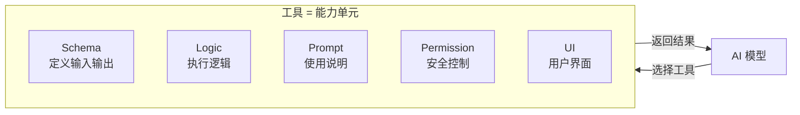

**借鉴价值**：
- 将 AI 能力模块化，每个能力独立开发、测试、部署
- 工具的提示词和逻辑放在一起，保证一致性
- 新增能力只需添加新工具，不需要修改核心逻辑

### 1.2 对话即程序（Conversation-as-Program）

整个对话过程本质上是一个程序的执行：

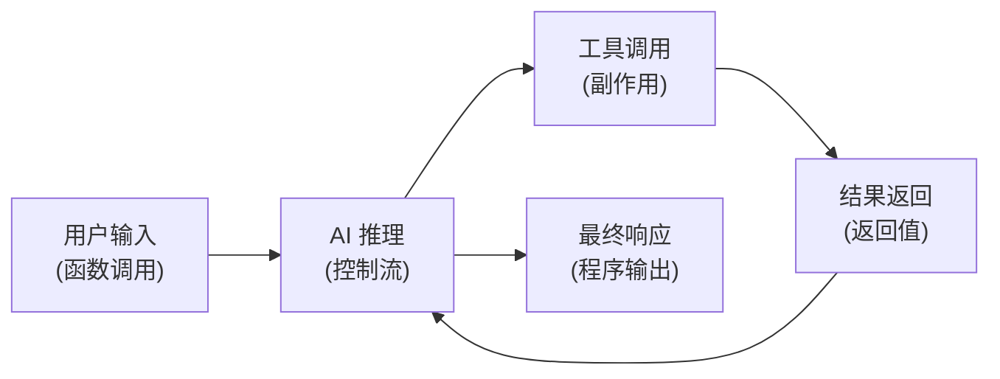

queryLoop 就是这个"程序"的解释器：
- 每一轮对话是一次循环迭代
- 工具调用是副作用操作
- 上下文压缩是垃圾回收
- 会话记忆是持久化存储

### 1.3 安全即架构（Security-by-Architecture）

安全不是事后补丁，而是架构的一部分：

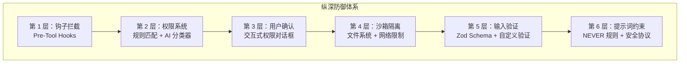

**借鉴价值**：
- 多层防御，任何一层被突破都有下一层兜底
- 安全检查嵌入到工具执行的每个环节
- 提示词本身也是安全策略的一部分

## 二、架构模式分析

### 2.1 AsyncGenerator 驱动的流式架构

整个项目大量使用 `async function*` (AsyncGenerator)，这是最核心的架构模式：

```typescript
// 查询循环
async function* queryLoop(params): AsyncGenerator<StreamEvent | Message, Terminal>

// 工具编排
async function* runTools(blocks, ...): AsyncGenerator<MessageUpdate, void>

// 工具执行
async function* runToolUse(block, ...): AsyncGenerator<MessageUpdateLazy, void>

// 钩子执行
async function* executeHooks(config): AsyncGenerator<HookResult, void>
```

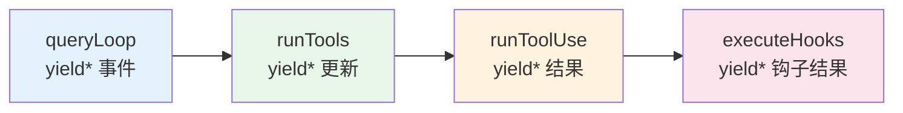

**设计优势**：
- 天然支持流式处理，不需要回调地狱
- 通过 `yield*` 实现优雅的组合
- 支持中断（通过 AbortController）
- 内存友好，不需要缓存完整结果

**借鉴价值**：对于需要流式处理的 AI 应用，AsyncGenerator 是比 callback/Promise 更优雅的选择。

### 2.2 并发控制的工具编排

工具编排器实现了智能的并发控制：

```typescript
function partitionToolCalls(toolUseMessages, context): Batch[] {
  // 将工具调用分为：
  // 1. 并发安全的批次（如多个文件读取）→ 并行执行
  // 2. 非并发安全的批次（如文件写入）→ 串行执行
}
```

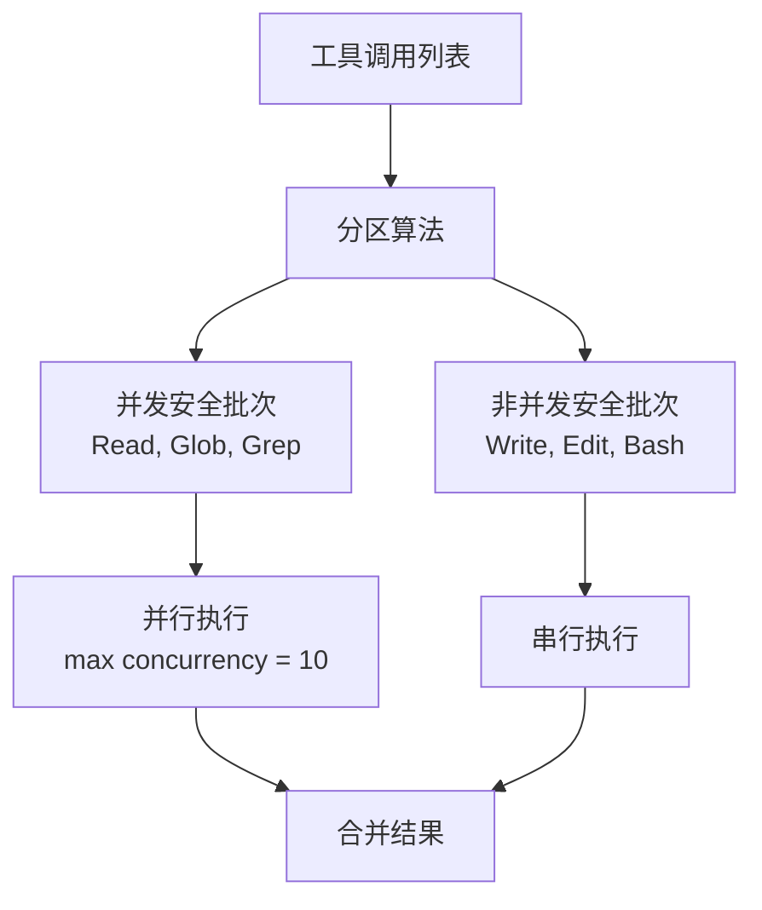

**设计细节**：
- 每个工具声明自己是否 `isConcurrencySafe`
- 连续的并发安全工具合并为一个批次
- 最大并发数可通过环境变量配置
- 上下文修改器（contextModifier）在批次完成后统一应用

### 2.3 插件化的工具注册

```typescript
function getAllBaseTools(): Tools {
  return [
    FileReadTool, FileEditTool, FileWriteTool,
    GlobTool, GrepTool, BashTool,
    AgentTool, WebSearchTool, WebFetchTool,
    // ... 条件注册
    ...(feature('POWERSHELL') ? [getPowerShellTool()] : []),
    ...(feature('MONITOR_TOOL') ? [...] : []),
  ]
}

function getTools(permissionContext): Tools {
  let tools = getAllBaseTools()
  tools = filterToolsByDenyRules(tools, permissionContext)
  tools = assembleToolPool(tools, permissionContext)
  return getMergedTools(tools, permissionContext)
}
```

**借鉴价值**：
- 工具注册支持条件编译（feature flag）
- 运行时根据权限上下文过滤工具
- MCP 工具和内置工具统一管理

### 2.4 轻量级状态管理

没有使用 Redux 等重型方案，而是自研了一个极简的 Store：

```typescript
function createStore<T>(initialState: T, onChange?: OnChange<T>): Store<T> {
  let state = initialState
  const listeners = new Set<Listener>()
  return {
    getState: () => state,
    setState: (updater) => {
      const prev = state
      const next = updater(prev)
      if (Object.is(next, prev)) return  // 引用相等跳过
      state = next
      onChange?.({ newState: next, oldState: prev })
      for (const listener of listeners) listener()
    },
    subscribe: (listener) => {
      listeners.add(listener)
      return () => listeners.delete(listener)
    },
  }
}
```

**设计特点**：
- 30 行代码实现完整的发布-订阅
- `Object.is` 比较避免无效更新
- 支持 onChange 回调做副作用
- 与 React 的 `useSyncExternalStore` 无缝集成

### 2.5 钩子系统的事件驱动架构

钩子系统是一个完整的事件驱动框架（5000+ 行）：

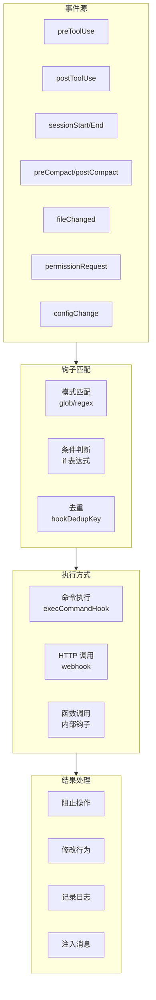

## 三、关键设计决策分析

### 3.1 为什么选择终端 UI 而非 Web UI？

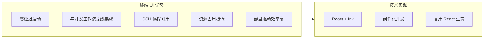

### 3.2 为什么用 Bun 而非 Node.js？

- **启动速度**：Bun 的启动速度比 Node.js 快数倍
- **内置 bundler**：支持 `bun:bundle` 的 feature flag 条件编译
- **TypeScript 原生支持**：无需编译步骤
- **性能**：更快的文件 I/O 和网络操作

### 3.3 为什么自研 Store 而非用 Redux？

- **极简需求**：只需要发布-订阅，不需要 middleware、time-travel 等
- **性能**：30 行代码 vs Redux 的数千行
- **类型安全**：完全的 TypeScript 类型推断
- **无依赖**：减少包体积

### 3.4 为什么大量使用 AsyncGenerator？

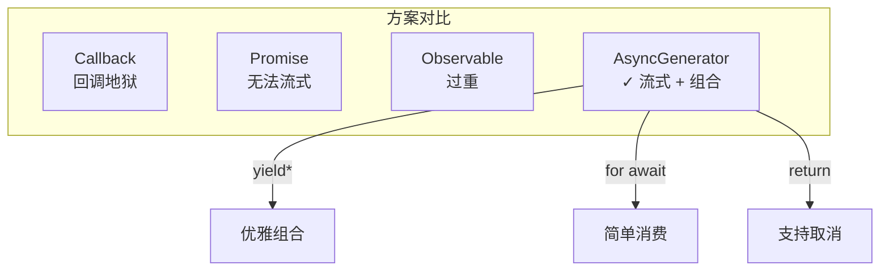

## 四、可借鉴的设计模式

### 4.1 工具定义模式

```typescript
// 每个工具是一个自包含的模块
const MyTool = buildTool({
  name: 'MyTool',
  inputSchema: z.object({ ... }),
  async call(input, context) { ... },
  async prompt(options) { ... },
  checkPermissions(input, context) { ... },
  isReadOnly(input) { ... },
  isConcurrencySafe(input) { ... },
  renderToolUseMessage(input) { ... },
})
```

**适用场景**：任何需要 AI 调用外部能力的系统。

### 4.2 权限检查链模式

```typescript
// 权限检查是一个链式过程
async function checkPermissionsAndCallTool(tool, input, context) {
  // 1. Pre-tool hooks
  const hookResult = await runPreToolUseHooks(...)
  if (hookResult.blocked) return blocked
  
  // 2. Tool-level permission check
  const permResult = tool.checkPermissions(input, context)
  
  // 3. Auto-mode / classifier check
  if (autoMode) return classifierDecision(...)
  
  // 4. User confirmation
  return await promptUser(...)
}
```

### 4.3 上下文窗口管理模式

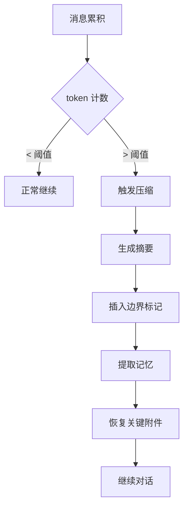

**借鉴价值**：任何长对话 AI 应用都需要类似的上下文管理策略。

### 4.4 Feature Flag 条件编译模式

```typescript
import { feature } from 'bun:bundle'

// 编译时决定是否包含代码
const MonitorMcpTask = feature('MONITOR_TOOL')
  ? require('./tasks/MonitorMcpTask').MonitorMcpTask
  : null

// 提示词中的条件分支
const sleepSubitems = [
  ...(feature('MONITOR_TOOL')
    ? ['Use the Monitor tool to stream events...']
    : ['If you must poll, use a check command...']),
]
```

**借鉴价值**：通过编译时 feature flag 实现不同版本的差异化，避免运行时判断的开销。

### 4.5 懒加载与预取模式

```typescript
// 懒加载避免循环依赖
const proactiveModule = feature('PROACTIVE')
  ? require('../proactive/index.js')
  : null

// 预取提升性能
using pendingMemoryPrefetch = startRelevantMemoryPrefetch(messages, context)
const pendingSkillPrefetch = skillPrefetch?.startSkillDiscoveryPrefetch(...)
```

## 五、补充：深入阅读后的额外发现

### 5.1 自定义 Ink 渲染引擎

项目内置了一个完整的终端 UI 渲染引擎（96 个文件），而非使用 npm 上的 Ink：

- 纯 TypeScript 实现的 Yoga 布局引擎（替代 C++ 原生绑定）
- 完整的组件系统、事件系统、动画框架
- BiDi 文本支持、主题系统

**借鉴价值**：当第三方库不满足需求时，可以 fork 并深度定制。

### 5.2 Token 预算与收益递减检测

```typescript
// 不是简单的硬限制，而是智能检测
if (isDiminishing && deltaSinceLastCheck < 500) return { action: 'stop' }
```

连续 3 次增量低于 500 tokens 时判定为收益递减，自动停止。

### 5.3 流式健康监控

API 调用中实现了三层流式健康监控：
1. 空闲看门狗（90 秒无数据自动中断）
2. 停顿检测（30 秒间隔告警）
3. 非流式降级（流式失败自动降级）

### 5.4 Prompt Cache 优化

- Beta Header 锁存：一旦发送，整个会话保持不变，避免缓存失效
- 缓存断点检测：监控 cache_read vs cache_creation tokens
- 沙箱路径规范化：`$TMPDIR` 替代用户特定路径，使提示词跨用户一致
- 工具 Schema 去重：节省 150-200 tokens/请求

### 5.5 依赖注入测试模式

query/deps.ts 实现了轻量级依赖注入：

```typescript
export type QueryDeps = {
  callModel: typeof queryModelWithStreaming
  microcompact: typeof microcompactMessages
  autocompact: typeof autoCompactIfNeeded
  uuid: () => string
}
// 测试时注入 fakes，生产时用 productionDeps()
```

### 5.6 数据迁移系统

支持模型和配置的平滑迁移链：Fennec → Opus → Opus 1M → Sonnet 4.5 → Sonnet 4.6

### 5.7 Companion 虚拟宠物

基于用户 ID 的确定性随机生成虚拟宠物，包含稀有度、属性、外观等 RPG 元素。纯粹的开发者体验彩蛋。

## 六、架构演进启示

### 5.1 从单 Agent 到多 Agent

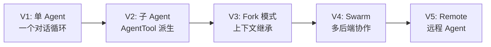

### 5.2 从静态提示词到动态提示词

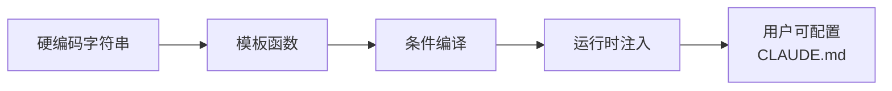

### 5.3 从简单权限到纵深防御


## 六、总结

Claude Code 的架构设计体现了几个核心理念：

1. **模块化**：工具、命令、服务、钩子都是独立模块
2. **流式优先**：AsyncGenerator 贯穿整个数据流
3. **安全内建**：安全不是附加功能，而是架构的一部分
4. **可扩展**：MCP、钩子、技能、插件提供多种扩展点
5. **渐进增强**：feature flag 支持不同版本的能力差异
6. **开发者体验**：终端原生、快捷键、Vim 模式、主题系统

这些设计思想不仅适用于 AI 编程助手，对于任何需要 AI 深度集成的开发工具都有参考价值。


---

## 相关文档

- [01-项目整体说明](./01-项目整体说明.md) — 功能模块介绍
- [02-项目架构文档](./02-项目架构文档.md) — 架构图、流程图
- [03-元提示词分析与借鉴](./03-元提示词分析与借鉴.md) — 提示词设计模式
- [05-项目优缺点分析](./05-项目优缺点分析.md) — 优缺点与改进建议
- [分模块源码解析](./readme/00-目录.md) — 13 个模块的详细源码解析
