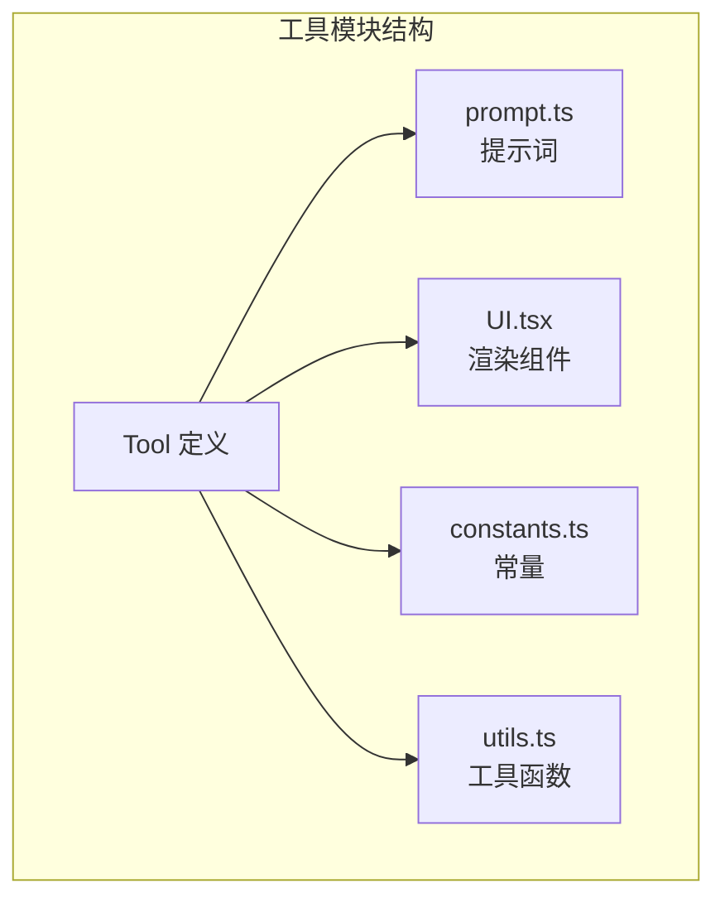
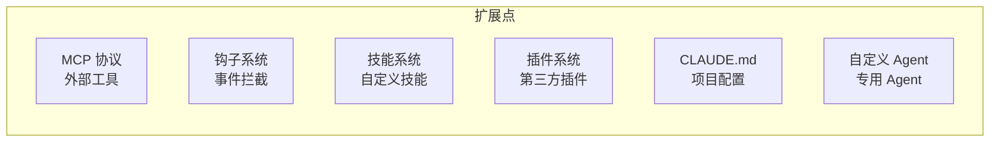
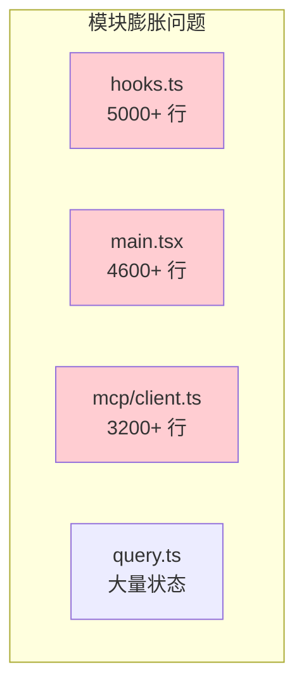
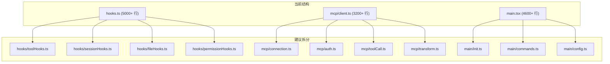

# Claude Code 源码解读：项目优缺点分析

## 一、优点

### 1.1 工具系统设计精良

工具系统是整个项目最出色的部分。每个工具都是一个自包含的模块，包含 Schema、逻辑、提示词、权限、UI 五个维度：



优势体现在：
- 新增工具只需创建一个目录，不需要修改核心代码
- 工具的提示词和实现放在一起，保证一致性
- 每个工具独立声明并发安全性、只读性、破坏性等属性
- 工具的 UI 渲染也是工具自身负责，实现了完全的封装

### 1.2 AsyncGenerator 流式架构

大量使用 AsyncGenerator 实现流式处理是一个非常优雅的架构决策：

- `queryLoop` 通过 `yield*` 组合多个子生成器
- 工具执行、钩子执行、API 调用都是生成器
- 天然支持中断（AbortController）和背压
- 代码可读性远优于回调或 Observable 方案

### 1.3 纵深防御的安全体系

安全设计是工业级的：

- 6 层防御（钩子 → 权限 → 用户确认 → 沙箱 → 输入验证 → 提示词约束）
- 沙箱系统控制文件系统和网络访问
- 路径验证防止越权访问
- Git 安全协议防止危险操作
- 自动模式有熔断机制（连续拒绝后降级为手动确认）

### 1.4 提示词工程水平极高

提示词设计展示了工业级的水准：

- 动态生成而非静态字符串
- 多层组合支持覆盖和追加
- 用示例驱动行为
- 明确的反模式警告
- 安全规则嵌入提示词

### 1.5 上下文管理策略完善

对 LLM 上下文窗口的管理非常成熟：

- 自动压缩（AutoCompact）在接近限制时触发
- 微压缩（MicroCompact）对单个工具结果精细处理
- 部分压缩（PartialCompact）只压缩前半部分
- 会话记忆跨对话保持关键信息
- 记忆提取自动从对话中提取有价值信息

### 1.6 可扩展性设计

提供了多种扩展机制：



### 1.7 工具编排的并发控制

工具编排器的分区算法很巧妙：
- 自动识别并发安全的工具批次
- 并发安全的工具并行执行（最大并发 10）
- 非并发安全的工具串行执行
- 上下文修改器在批次完成后统一应用

### 1.8 轻量级状态管理

30 行代码的 Store 实现了完整的发布-订阅模式，与 React 无缝集成，没有引入不必要的复杂性。

### 1.9 MCP 协议的完整实现

既是 MCP 客户端也是 MCP 服务器：
- 支持 stdio 和 SSE 两种传输
- 支持 OAuth 认证
- 批量并行连接多个服务器
- 工具自动发现和注册

### 1.10 开发者体验

- 终端原生，启动快
- Vim 模式支持
- 丰富的快捷键
- 主题系统
- 语音输入
- 成本追踪

### 1.11 流式健康监控

API 调用中实现了工业级的流式健康监控：
- 空闲看门狗（90 秒无数据自动中断，防止连接静默断开）
- 停顿检测（30 秒间隔告警，记录停顿次数和总时长）
- 非流式降级（流式失败自动降级为非流式请求）
- 重试机制（withRetry 包装，支持模型降级和 fallback）

### 1.12 Prompt Cache 优化策略

对 API 调用成本的极致优化：
- Beta Header 锁存机制，避免会话中途缓存失效
- 缓存断点检测，主动监控缓存命中率
- 沙箱路径规范化，使提示词跨用户一致
- 工具 Schema 去重，每请求节省 150-200 tokens

### 1.13 依赖注入的测试友好设计

query/deps.ts 展示了轻量级依赖注入模式，使核心查询循环可测试：
```typescript
const deps = params.deps ?? productionDeps()
// 测试时注入 fakes，无需 spyOn 模块级函数
```

### 1.14 全局状态中心（bootstrap/state.ts）

`bootstrap/state.ts` 是一个 1755+ 行的全局状态中心，管理了整个应用的运行时状态：
- 会话 ID、项目路径、CWD
- Token 使用统计、成本追踪
- 模型配置、Beta Header 锁存
- 遥测计数器（session、LOC、PR、commit、cost、token）
- Cron 任务、插件状态
- 权限模式、Plan 模式状态
- 所有这些都通过简单的 getter/setter 函数暴露，避免了复杂的状态管理框架

### 1.15 系统提示词的精细化管理

`constants/prompts.ts` 展示了工业级的系统提示词管理：
- 静态/动态分界线（`SYSTEM_PROMPT_DYNAMIC_BOUNDARY`）优化全局缓存
- 动态部分使用注册表模式（`systemPromptSection`）支持缓存
- 内部版本和外部版本通过 `process.env.USER_TYPE === 'ant'` 条件分支
- 代码风格指南直接嵌入提示词（不过度工程、不添加不必要的注释等）
- 操作风险评估框架（可逆性、影响范围、破坏性检查）

## 二、缺点与不足

### 2.1 代码规模过大，模块边界模糊

项目有 800+ 个文件，部分模块的职责边界不够清晰：

- `src/utils/hooks.ts` 单文件超过 5000 行，承担了太多职责
- `src/utils/` 目录有 300+ 个文件，缺乏进一步的分类组织
- `src/main.tsx` 作为入口文件过于庞大，混合了命令注册、初始化、配置等多种逻辑



### 2.2 循环依赖问题

代码中多处使用懒加载 `require()` 来规避循环依赖：

```typescript
// 多处出现这种模式
const proactiveModule = feature('PROACTIVE')
  ? require('../proactive/index.js')
  : null

// 注释中明确提到
// Lazy require to avoid circular dependency at module load time
const { getCoordinatorSystemPrompt } = require('../coordinator/coordinatorMode.js')
```

这说明模块间的依赖关系设计存在问题，需要通过运行时懒加载来打破循环。

### 2.3 过度依赖环境变量

项目大量使用环境变量控制行为：

```typescript
process.env.CLAUDE_CODE_MAX_TOOL_USE_CONCURRENCY
process.env.CLAUDE_CODE_DISABLE_BACKGROUND_TASKS
process.env.CLAUDE_CODE_COORDINATOR_MODE
process.env.CLAUDE_CODE_SIMPLE
process.env.USER_TYPE
// ... 数十个环境变量
```

问题：
- 缺乏集中的环境变量文档
- 部分环境变量在多处读取，难以追踪影响范围
- 环境变量和 feature flag 混用，增加理解成本

### 2.4 类型安全的妥协

部分代码存在类型安全的妥协：

```typescript
// 多处使用 as never 强制类型转换
const finalResult = await tool.call((args ?? {}) as never, toolUseContext, ...)

// 特殊命名约束绕过 lint
class McpToolCallError_I_VERIFIED_THIS_IS_NOT_CODE_OR_FILEPATHS extends Error
```

`_I_VERIFIED_THIS_IS_NOT_CODE_OR_FILEPATHS` 这种命名模式说明有自定义 lint 规则防止敏感信息泄露，但通过命名约定绕过不够优雅。

### 2.5 测试覆盖的不确定性

从源码结构来看：
- `src/tools/testing/` 只有一个 `TestingPermissionTool.tsx`
- 没有看到明显的测试目录结构（可能在源码之外）
- 工具的 prompt 测试尤其重要但难以自动化

### 2.6 错误处理不够统一

不同模块的错误处理方式不一致：

```typescript
// 有些用 try-catch
try { ... } catch (error) { logError(error) }

// 有些用 Result 模式
const validationResult = await tool.validateInput?.(...)
if (validationResult && !validationResult.result) { ... }

// 有些直接 throw
throw new Error(`Tool ${name} not found`)
```

缺乏统一的错误处理策略和错误类型层次。

### 2.7 编译产物中包含 sourcemap

从读取的文件内容可以看到，编译产物中内联了 base64 编码的 sourcemap：

```
//# sourceMappingURL=data:application/json;charset=utf-8;base64,...
```

这增加了文件体积，在生产环境中可能不是最优选择。

### 2.8 部分代码的可读性问题

React Compiler 的输出代码可读性较差：

```typescript
// React Compiler 输出
export function App(t0) {
  const $ = _c(9);
  const { getFpsMetrics, stats, initialState, children } = t0;
  let t1;
  if ($[0] !== children || $[1] !== initialState) {
    t1 = <AppStateProvider ...>{children}</AppStateProvider>;
    $[0] = children; $[1] = initialState; $[2] = t1;
  } else { t1 = $[2]; }
```

虽然这是编译产物，但如果需要调试会增加难度。

### 2.9 MCP 客户端代码过于复杂

`src/services/mcp/client.ts` 超过 3200 行，承担了连接管理、认证、工具调用、结果转换等多种职责。应该拆分为更小的模块。

### 2.10 钩子系统过于庞大

`src/utils/hooks.ts` 超过 5000 行，包含了 50+ 个导出函数，涵盖了从工具钩子到会话钩子到文件钩子的所有类型。这个文件应该按事件类型拆分。

### 2.11 缺少统一的依赖注入框架

虽然 `query/deps.ts` 展示了依赖注入的雏形（4 个依赖），但整个项目缺乏统一的 DI 框架。大量模块通过直接 import 耦合，导致：
- 循环依赖需要懒加载规避
- 测试需要 `spyOn` 模块级函数
- 模块替换困难

### 2.12 Companion 系统的定位模糊

虚拟宠物系统（buddy/）虽然有趣，但在一个专业的编程工具中显得定位模糊。它增加了代码复杂度但对核心功能没有贡献。

## 三、改进建议

### 3.1 模块拆分



### 3.2 依赖注入替代懒加载

用依赖注入容器替代 `require()` 懒加载来解决循环依赖问题。

### 3.3 统一错误处理

建立统一的错误类型层次和处理策略：

```typescript
// 建议的错误层次
class ClaudeCodeError extends Error { }
class ToolError extends ClaudeCodeError { }
class PermissionError extends ClaudeCodeError { }
class ApiError extends ClaudeCodeError { }
class HookError extends ClaudeCodeError { }
```

### 3.4 环境变量集中管理

建立环境变量的集中注册和文档化机制，避免散落在各处。

## 四、总结

Claude Code 是一个工程质量很高的项目，其工具系统设计、流式架构、安全体系、提示词工程都达到了工业级水准。主要的不足集中在代码组织层面——部分模块过于庞大（hooks.ts 5000+ 行、messages.ts 5500+ 行、attachments.ts 3000+ 行、bootstrap/state.ts 1755+ 行、pluginLoader.ts 3300+ 行）、循环依赖需要懒加载规避、错误处理不够统一。这些是大型项目快速迭代过程中常见的技术债务，不影响其作为 AI 编程助手的核心价值。

特别值得学习的几个方面：
1. 系统提示词的精细化管理（静态/动态分界、注册表缓存、条件编译）
2. AsyncGenerator 驱动的流式架构（从 API 调用到工具执行到钩子系统全链路）
3. 纵深防御的安全体系（6 层防御 + 沙箱 + 提示词约束）
4. 工具系统的自包含设计（Schema + 逻辑 + 提示词 + 权限 + UI 五合一）
5. Prompt Cache 的极致优化（Beta Header 锁存、路径规范化、全局缓存作用域）
6. 上下文窗口的智能管理（自动压缩 + 微压缩 + 部分压缩 + 记忆提取）


---

## 相关文档

- [01-项目整体说明](./01-项目整体说明.md) — 功能模块介绍
- [02-项目架构文档](./02-项目架构文档.md) — 架构图、流程图
- [03-元提示词分析与借鉴](./03-元提示词分析与借鉴.md) — 提示词设计模式
- [04-架构设计思想与借鉴](./04-架构设计思想与借鉴.md) — 设计思想深度分析
- [分模块源码解析](./readme/00-目录.md) — 13 个模块的详细源码解析
