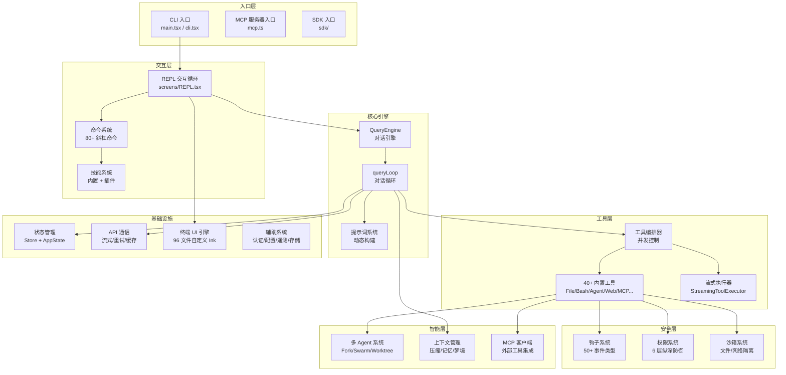
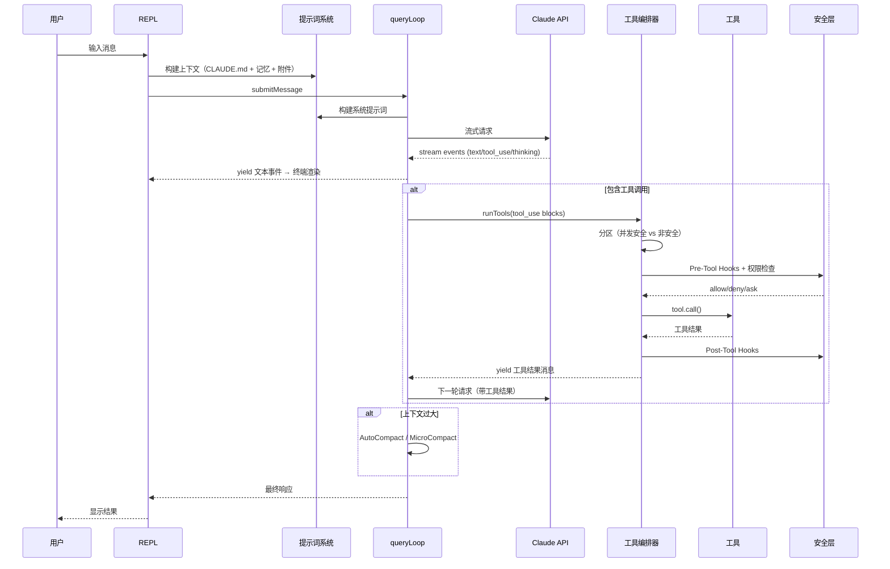

# Claude Code 源码解析文档

## 项目简介

Claude Code（内部代号 Tengu）是 Anthropic 开发的 AI 编程助手，以终端 CLI 为主要交互界面。它将 Claude 大语言模型深度集成到开发者工作流中，让 AI 能够直接读写文件、执行命令、搜索代码、管理 Git、协调多个 Agent 并行工作。

技术栈：Bun 运行时 + TypeScript + React + 自定义 Ink 终端 UI 引擎。

## 整体架构

## 核心设计理念

1. **AsyncGenerator 流式架构** — 从 API 调用到工具执行到钩子系统，全链路使用 `async function*`，天然支持流式、中断、背压
2. **工具即能力** — AI 的能力边界由工具定义，每个工具是自包含的模块（Schema + 逻辑 + 提示词 + 权限 + UI）
3. **安全内建** — 6 层纵深防御不是事后补丁，而是架构的一部分
4. **提示词即代码** — 提示词通过函数动态生成，支持条件编译、运行时注入、缓存优化

## 文档索引

| 编号 | 模块 | 核心文件 | 说明 |
|------|------|---------|------|
| [01](./01-核心引擎.md) | 核心引擎 | query.ts, Tool.ts, QueryEngine.ts | 对话循环、工具基类、工具编排、流式执行 |
| [02](./02-工具系统.md) | 工具系统 | src/tools/ (40+ 目录) | 每个工具的设计模式、注册、执行、权限 |
| [03](./03-提示词系统.md) | 提示词系统 | prompts.ts, systemPrompt.ts, attachments.ts | 系统提示词构建、工具提示词、上下文注入 |
| [04](./04-安全与权限.md) | 安全与权限 | permissions/, sandbox/, hooks.ts | 6 层防御、沙箱、权限规则、自动模式 |
| [05](./05-多Agent系统.md) | 多 Agent | AgentTool/, swarm/, teammate.ts | Fork、Swarm、Worktree、邮箱通信 |
| [06](./06-上下文管理.md) | 上下文管理 | compact/, SessionMemory/, extractMemories/ | 压缩策略、记忆提取、Auto Dream |
| [07](./07-MCP协议.md) | MCP 协议 | mcp/client.ts, mcp.ts | 客户端/服务器、工具发现、OAuth |
| [08](./08-钩子系统.md) | 钩子系统 | hooks.ts (5000行), types/hooks.ts | 50+ 事件、执行流程、输出 Schema |
| [09](./09-状态管理.md) | 状态管理 | store.ts, AppState.tsx, bootstrap/state.ts | Store、React Context、全局状态 |
| [10](./10-终端UI引擎.md) | 终端 UI | src/ink/ (96 文件) | Yoga 布局、Screen diff、事件系统 |
| [11](./11-命令与技能.md) | 命令与技能 | commands/, skills/, plugins/ | 80+ 命令、技能、插件系统 |
| [12](./12-API通信层.md) | API 通信 | api/claude.ts, modelCost.ts | 流式调用、重试、成本、Thinking/Effort |
| [13](./13-辅助系统.md) | 辅助系统 | auth.ts, config.ts, sessionStorage.ts | 认证、配置、存储、遥测、Bridge |

## 数据流全景

