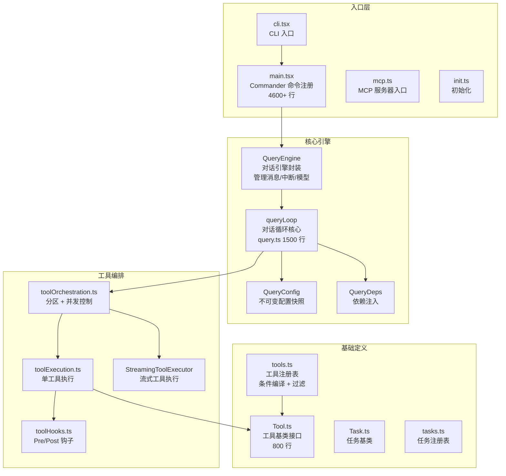
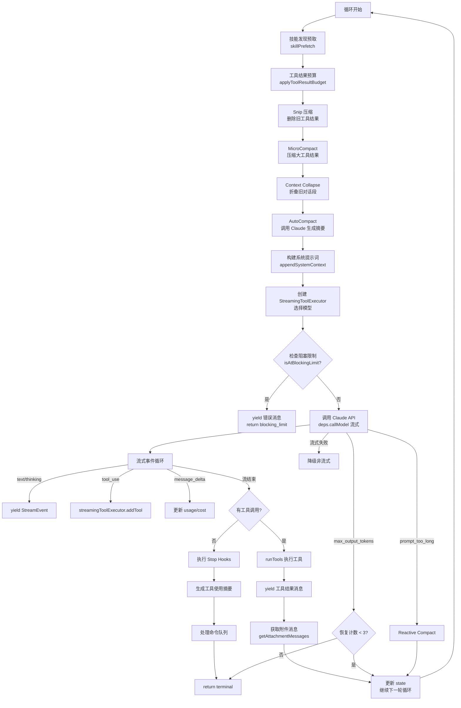
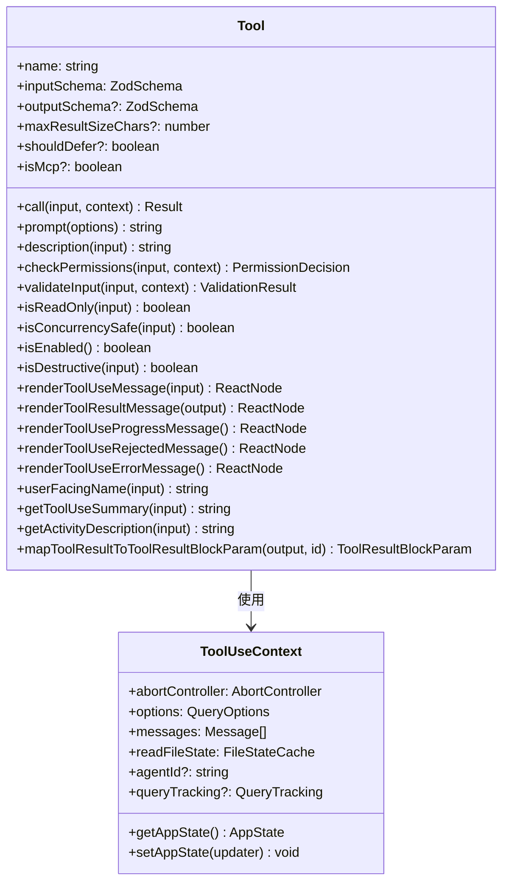
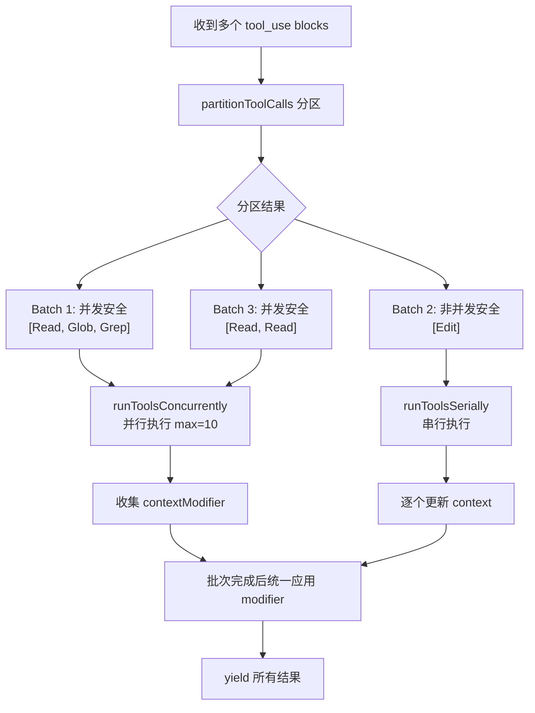
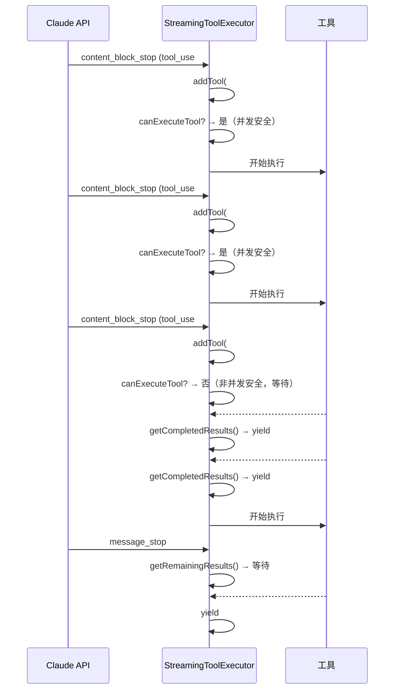

# 01 - 核心引擎

## 一、整体实现思路

核心引擎是 Claude Code 的心脏，实现了"用户输入 → AI 推理 → 工具执行 → 结果反馈"的完整闭环。它的核心设计思想是 **AsyncGenerator 驱动的流式循环**：整个对话过程是一个 `while(true)` 循环，每一轮迭代包含 API 调用、工具执行、上下文压缩三个阶段，通过 `yield` 将中间结果流式传递给 UI 层。

这个设计的关键优势：
- **流式处理**：API 响应一边到达一边渲染，工具一边执行一边返回结果
- **可中断**：通过 AbortController 随时中断当前循环
- **可组合**：通过 `yield*` 将子生成器的结果透传给父生成器
- **内存友好**：不需要缓存完整的中间结果

## 二、模块架构图



## 三、细分功能实现

### 3.1 queryLoop — 对话循环核心

queryLoop 是整个系统最核心的函数，位于 `src/query.ts`，约 1500 行。它是一个 `async function*`，在 `while(true)` 循环中执行以下步骤：



**关键状态管理**：

```typescript
type State = {
  messages: Message[]                    // 当前消息列表
  toolUseContext: ToolUseContext          // 工具执行上下文
  autoCompactTracking: AutoCompactTrackingState  // 压缩追踪
  maxOutputTokensRecoveryCount: number   // max_output_tokens 恢复计数
  hasAttemptedReactiveCompact: boolean   // 是否已尝试反应式压缩
  turnCount: number                      // 轮次计数
  pendingToolUseSummary: Promise<...>    // 待处理的工具摘要
  stopHookActive: boolean               // Stop Hook 是否激活
}
```

### 3.2 Tool 基类 — 工具接口定义

`src/Tool.ts` 定义了所有工具必须实现的接口，这是整个工具系统的契约：



**buildTool 工厂函数**：

每个工具通过 `buildTool()` 创建，它将工具定义对象转换为标准化的 Tool 实例：

```typescript
export const FileReadTool = buildTool({
  name: 'Read',
  inputSchema: z.object({ file_path: z.string(), offset: z.number().optional() }),
  async call({ file_path, offset }, context) { /* 读取文件 */ },
  async prompt(options) { return renderPromptTemplate(...) },
  checkPermissions(input, context) { /* 路径验证 */ },
  isConcurrencySafe() { return true },
  isReadOnly() { return true },
  renderToolUseMessage(input) { return <FilePathLink path={input.file_path} /> },
})
```

### 3.3 工具编排 — 并发控制

`src/services/tools/toolOrchestration.ts` 实现了智能的工具并发控制：



**分区算法的核心逻辑**：

```typescript
function partitionToolCalls(blocks, context): Batch[] {
  return blocks.reduce((acc, toolUse) => {
    const tool = findToolByName(context.options.tools, toolUse.name)
    const isSafe = tool?.isConcurrencySafe(parsedInput) ?? false
    
    // 连续的并发安全工具合并为一个批次
    if (isSafe && acc[acc.length - 1]?.isConcurrencySafe) {
      acc[acc.length - 1].blocks.push(toolUse)
    } else {
      acc.push({ isConcurrencySafe: isSafe, blocks: [toolUse] })
    }
    return acc
  }, [])
}
```

### 3.4 StreamingToolExecutor — 流式工具执行

`src/services/tools/StreamingToolExecutor.ts` 在 API 响应还在流式到达时就开始执行工具：



### 3.5 依赖注入 — 可测试性

`src/query/deps.ts` 实现了轻量级依赖注入：

```typescript
export type QueryDeps = {
  callModel: typeof queryModelWithStreaming  // API 调用
  microcompact: typeof microcompactMessages  // 微压缩
  autocompact: typeof autoCompactIfNeeded    // 自动压缩
  uuid: () => string                         // UUID 生成
}

// 生产环境
export function productionDeps(): QueryDeps {
  return { callModel: queryModelWithStreaming, microcompact, autocompact, uuid: randomUUID }
}

// 测试环境注入 fakes
const testDeps: QueryDeps = {
  callModel: async function*() { yield mockMessage },
  microcompact: async (msgs) => ({ messages: msgs }),
  autocompact: async () => ({ compactionResult: null }),
  uuid: () => 'test-uuid',
}
```

### 3.6 QueryConfig — 不可变配置快照

```typescript
// 在 queryLoop 入口处快照一次，整个循环内不变
type QueryConfig = {
  sessionId: SessionId
  gates: {
    streamingToolExecution: boolean  // 流式工具执行开关
    emitToolUseSummaries: boolean    // 工具摘要开关
    isAnt: boolean                   // 内部用户
    fastModeEnabled: boolean         // 快速模式
  }
}
```

## 四、学习要点

1. **queryLoop 是一个状态机** — State 对象在每轮循环开始时解构，在 continue 站点重新赋值
2. **错误恢复是分层的** — max_output_tokens（最多 3 次）→ prompt_too_long（反应式压缩）→ 流式失败（非流式降级）
3. **工具编排的分区算法** — 连续的并发安全工具合并为一个批次，非安全工具单独一个批次
4. **StreamingToolExecutor 的队列模型** — 并发安全的工具立即执行，非安全的等待前面完成
5. **依赖注入使核心循环可测试** — 4 个依赖通过 QueryDeps 注入，测试时替换为 fakes
