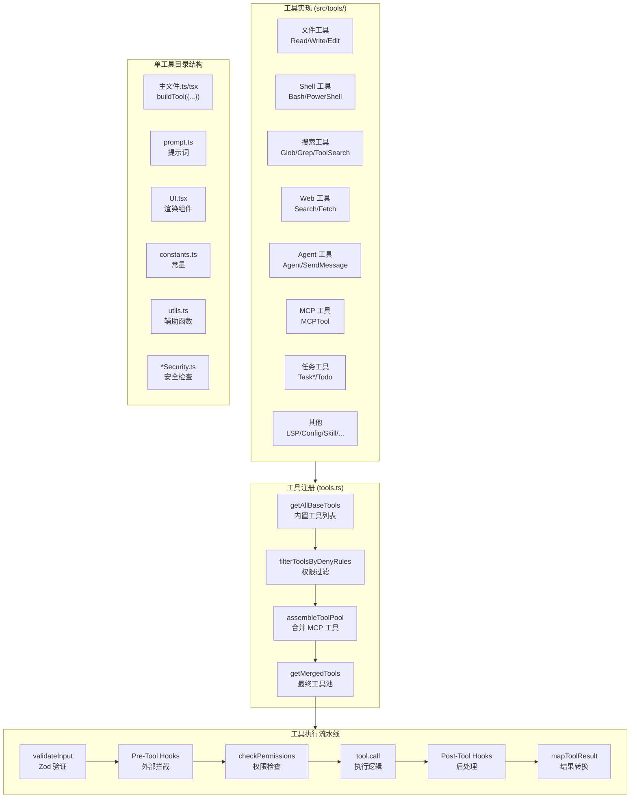
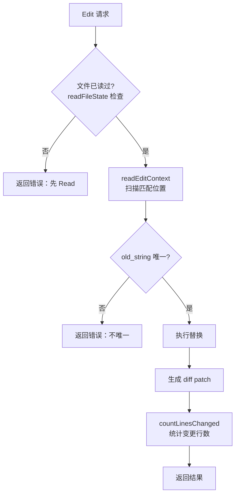
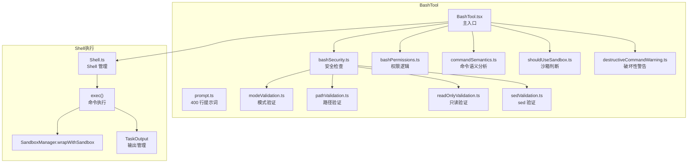
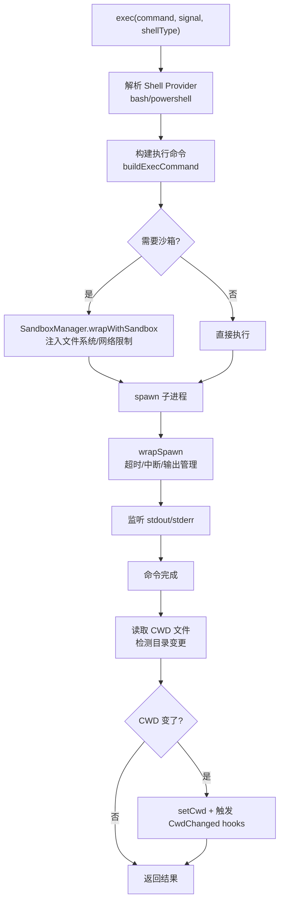
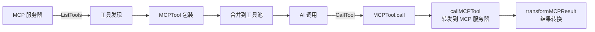
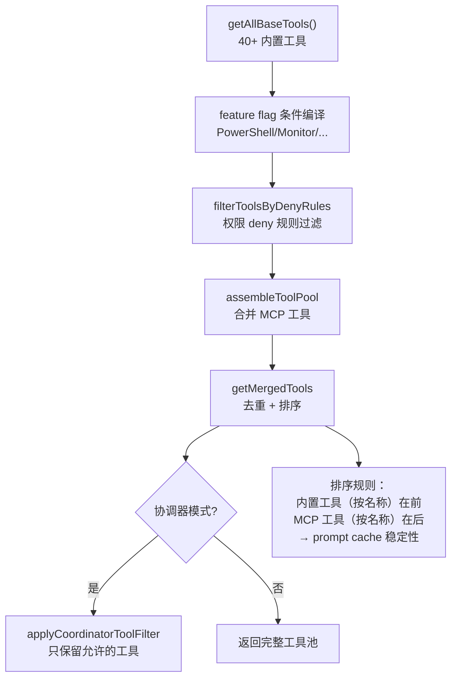

# 02 - 工具系统

## 一、整体实现思路

工具系统是 Claude Code 的能力层——AI 能做什么，完全由它拥有的工具决定。整个系统的设计遵循"**工具即能力单元**"的理念：每个工具是一个自包含的模块，包含输入 Schema（Zod 定义）、执行逻辑（call）、使用说明（prompt）、权限检查（checkPermissions）、UI 渲染（render*）五个维度。

工具系统的三个核心设计决策：
1. **自包含**：工具的提示词和实现放在同一目录，修改工具不需要改动核心代码
2. **声明式并发**：每个工具声明自己是否并发安全，编排器据此决定并行/串行
3. **动态组合**：内置工具 + MCP 工具 + 插件工具在运行时合并为统一的工具池

## 二、模块架构图



## 三、细分功能实现

### 3.1 文件操作工具

#### Read（FileReadTool）

**实现要点**：
- 支持文本文件、图片（PNG/JPG）、PDF（分页提取）、Jupyter Notebook
- 带行号输出（`cat -n` 格式），支持 offset/limit 分页
- 文件状态缓存（FileStateCache）避免重复读取
- 大文件限制：默认最多 2000 行

**提示词关键指令**：
```
Assume this tool is able to read all files on the machine.
If the User provides a path to a file assume that path is valid.
It is okay to read a file that does not exist; an error will be returned.
```
→ 消除 AI 的"犹豫"，让它大胆尝试。

#### Edit（FileEditTool）

**实现要点**：
- 精确字符串替换（old_string → new_string），不是行号编辑
- 要求 old_string 在文件中唯一，否则失败
- 支持 `replace_all` 全局替换
- 必须先 Read 再 Edit（通过 readFileState 检查）
- `readEditContext` 优化：只读取匹配位置周围的上下文，不加载整个大文件



#### Write（FileWriteTool）

**提示词关键指令**：
```
Prefer the Edit tool for modifying existing files — it only sends the diff.
NEVER create documentation files (*.md) or README files unless explicitly requested.
```

### 3.2 Shell 执行工具

#### Bash（BashTool，18 个文件，最复杂的工具）

**架构**：



**Shell.exec() 执行流程**：



### 3.3 Agent 工具

详见 [05-多Agent系统.md](./05-多Agent系统.md)。

### 3.4 Web 工具

#### WebFetch

**实现要点**：
- 抓取网页 → 转 Markdown → 用 Haiku 模型提取关键内容
- 预批准域名列表（docs.anthropic.com 等）自动放行
- 重定向检测：跨域重定向返回提示而非自动跟随
- 二进制内容（PDF 等）保存到磁盘并返回路径

#### WebSearch

**提示词关键指令**：
```
CRITICAL REQUIREMENT: After answering, you MUST include a "Sources:" section
The current month is ${currentMonthYear}. Use this year when searching.
```

### 3.5 MCP 工具（MCPTool）

将外部 MCP 服务器的工具包装为内置工具格式：



### 3.6 工具注册与过滤



## 四、学习要点

1. **工具是自包含的** — 新增工具只需创建目录，不改核心代码
2. **提示词是工具的 API 文档** — 告诉 AI 什么时候用、怎么用、不要怎么用
3. **BashTool 是最复杂的工具** — 18 个文件，涵盖安全、权限、沙箱、语义分析
4. **readEditContext 是性能优化** — 大文件只读匹配位置周围的上下文
5. **工具排序影响 prompt cache** — 内置在前 MCP 在后，按名称排序保证稳定
