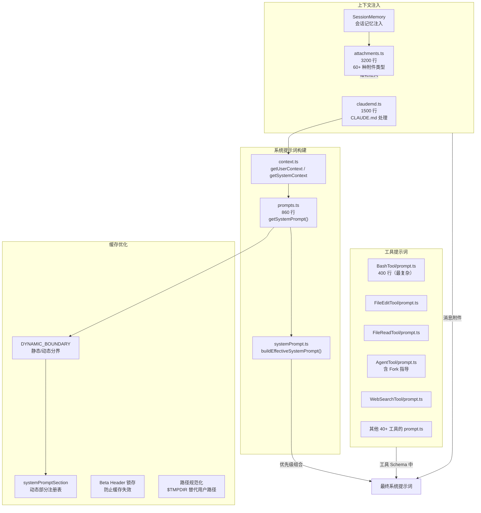
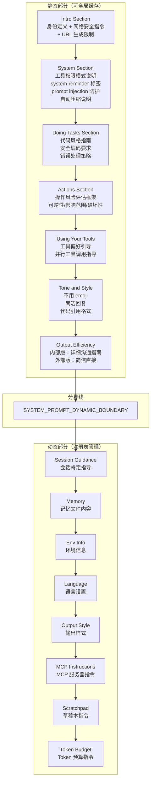
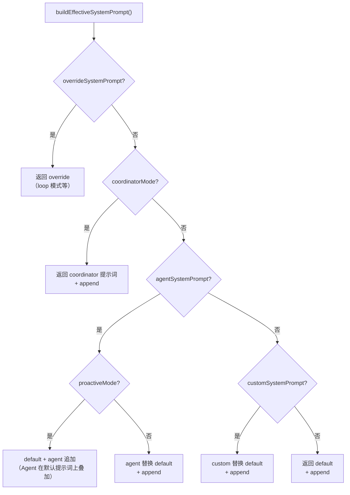
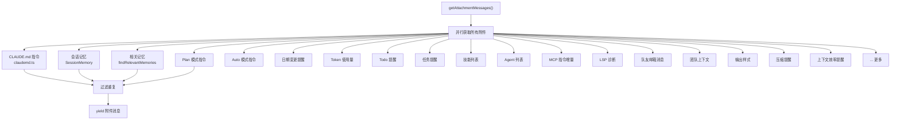
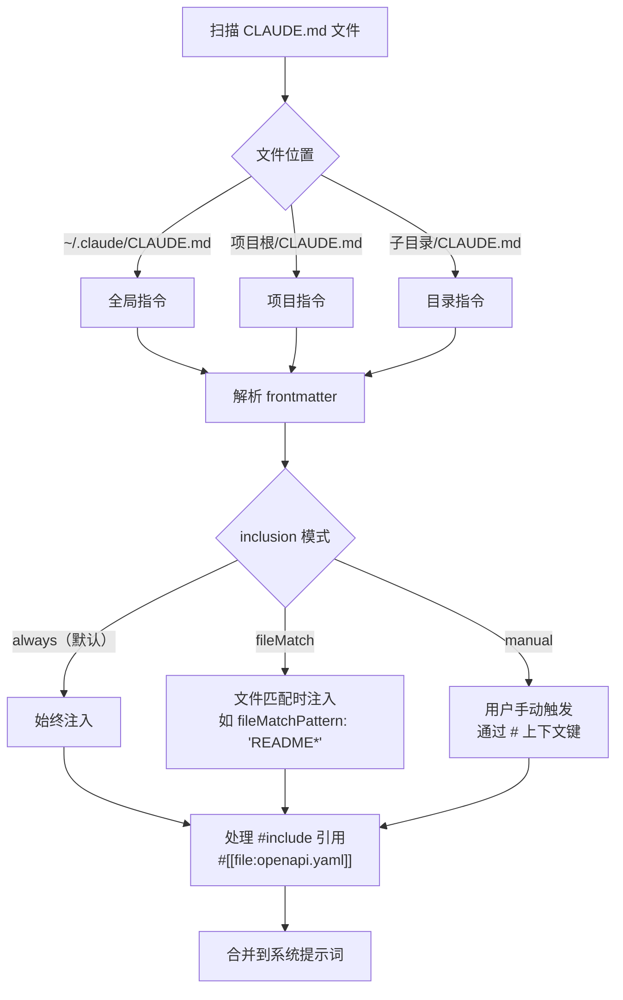
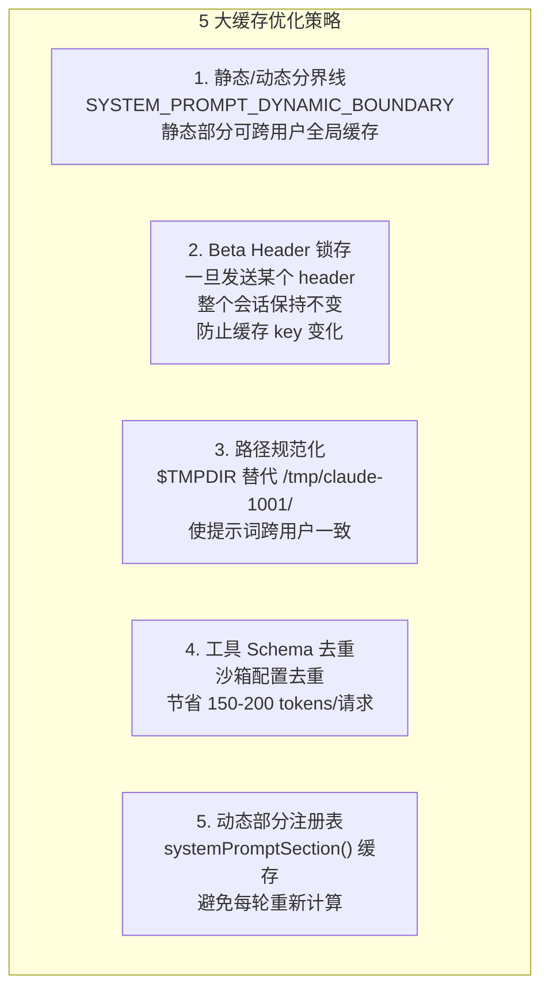

# 03 - 提示词系统

## 一、整体实现思路

Claude Code 的提示词系统是整个项目最精妙的部分之一。它不是一个静态字符串，而是一个**多层动态组合的工程体系**，由三个层面构成：系统提示词（告诉 AI 它是谁、该怎么做）、工具提示词（告诉 AI 每个工具怎么用）、上下文注入（把运行时信息动态注入对话）。

核心设计思想：
- **提示词即代码**：通过函数动态生成，支持条件编译（`feature()` 门控）、运行时注入（环境信息、配置）、版本差异（内部/外部用户）
- **缓存优先**：静态部分和动态部分有明确分界线（`SYSTEM_PROMPT_DYNAMIC_BOUNDARY`），静态部分可跨用户全局缓存，直接影响 API 成本
- **分层组合**：系统提示词支持覆盖、替换、追加三种模式，不同场景（Agent、协调器、自定义）有不同的组合策略

## 二、模块架构图



## 三、细分功能实现

### 3.1 系统提示词构建（prompts.ts）

`getSystemPrompt()` 是系统提示词的入口函数，构建的提示词由以下部分组成：



**关键代码逻辑**：

```typescript
async function getSystemPrompt(tools, model, ...): string[] {
  // 动态部分通过注册表管理，支持缓存
  const dynamicSections = [
    systemPromptSection('session_guidance', () => getSessionSpecificGuidanceSection(...)),
    systemPromptSection('memory', () => loadMemoryPrompt()),
    systemPromptSection('env_info_simple', () => computeSimpleEnvInfo(model)),
    systemPromptSection('language', () => getLanguageSection(settings.language)),
    // ... 更多动态部分
  ]

  return [
    // --- 静态内容（可全局缓存）---
    getSimpleIntroSection(outputStyleConfig),
    getSimpleSystemSection(),
    getSimpleDoingTasksSection(),
    getActionsSection(),
    getUsingYourToolsSection(enabledTools),
    getSimpleToneAndStyleSection(),
    getOutputEfficiencySection(),
    // === 分界线 ===
    ...(shouldUseGlobalCacheScope() ? [SYSTEM_PROMPT_DYNAMIC_BOUNDARY] : []),
    // --- 动态内容 ---
    ...resolvedDynamicSections,
  ]
}
```

### 3.2 提示词优先级组合（systemPrompt.ts）

不同场景下，系统提示词的组合策略不同：



**优先级从高到低**：Override > Coordinator > Agent > Custom > Default，append 始终追加在末尾。

### 3.3 工具提示词设计模式

每个工具的 `prompt.ts` 是告诉 AI 如何使用该工具的"API 文档"。以下是从源码中提炼的关键设计模式：

#### 模式一：工具偏好引导（BashTool）

```
IMPORTANT: Avoid using this tool to run cat, head, tail, sed, awk commands.
Instead, use the appropriate dedicated tool:
- File search: Use GlobTool (NOT find or ls)
- Content search: Use GrepTool (NOT grep or rg)
- Read files: Use Read (NOT cat/head/tail)
- Edit files: Use Edit (NOT sed/awk)
```

**原理**：当系统有多个工具时，明确告诉 AI 什么场景用什么工具，用 `NOT` 强调不要用什么。

#### 模式二：NEVER 红线（BashTool Git 安全协议）

```
Git Safety Protocol:
- NEVER update the git config
- NEVER run destructive git commands (push --force, reset --hard...)
- NEVER skip hooks (--no-verify, --no-gpg-sign)
- CRITICAL: Always create NEW commits rather than amending
```

**原理**：对于危险操作，使用 `NEVER` + `CRITICAL` 强调词，并给出明确的例外条件（"unless the user explicitly requests"）。

#### 模式三：结构化操作指南（BashTool Git 提交）

```
1. Run the following bash commands in parallel:
   - Run a git status command...
   - Run a git diff command...
2. Analyze all staged changes and draft a commit message
3. Run the following commands in parallel:
   - Add relevant untracked files
   - Create the commit
```

**原理**：对于复杂的多步骤操作，使用编号步骤，并明确标注哪些可以并行、哪些必须串行。

#### 模式四：角色比喻（AgentTool）

```
Brief the agent like a smart colleague who just walked into the room —
it hasn't seen this conversation, doesn't know what you've tried,
doesn't understand why this task matters.
```

**原理**：用比喻帮助 AI 理解子 Agent 的上下文限制。

#### 模式五：反模式警告（AgentTool）

```
**Never delegate understanding.** Don't write "based on your findings, fix the bug"
or "based on the research, implement it." Those phrases push synthesis onto the agent
instead of doing it yourself.
```

**原理**：不仅告诉 AI 该做什么，还明确告诉它不该做什么，并解释为什么。

#### 模式六：命令式短语（AgentTool Fork）

```
**Don't peek.** The tool result includes an output_file path —
do not Read or tail it unless the user explicitly asks.

**Don't race.** After launching, you know nothing about what the fork found.
Never fabricate or predict fork results.
```

**原理**：用简短有力的命令式短语（Don't peek, Don't race）建立行为规则。

#### 模式七：消除犹豫（FileReadTool）

```
Assume this tool is able to read all files on the machine.
If the User provides a path to a file assume that path is valid.
It is okay to read a file that does not exist; an error will be returned.
```

**原理**：明确告诉 AI 可以大胆尝试，错误会被优雅处理。

#### 模式八：强制输出格式（WebSearchTool）

```
CRITICAL REQUIREMENT - You MUST follow this:
- After answering, you MUST include a "Sources:" section
- This is MANDATORY - never skip including sources
```

**原理**：对于必须遵守的规则，使用 `CRITICAL REQUIREMENT` + `MUST` + `MANDATORY` 三重强调。

### 3.4 上下文注入（attachments.ts）

`attachments.ts`（3200 行）管理 60+ 种附件类型，在每轮对话前动态注入：



### 3.5 CLAUDE.md 处理（claudemd.ts）



### 3.6 Prompt Cache 优化策略

这是直接影响 API 成本的关键优化：



**Beta Header 锁存机制**：

```typescript
// 一旦激活，整个会话保持不变
let afkHeaderLatched = getAfkModeHeaderLatched()
if (!afkHeaderLatched && isAutoModeActive()) {
  afkHeaderLatched = true
  setAfkModeHeaderLatched(true)  // 持久化
}
// 后续每次 API 调用都带上这个 header
if (afkHeaderLatched) betas.push(AFK_MODE_BETA_HEADER)

// /clear 和 /compact 时重置
function clearBetaHeaderLatches() { ... }
```

## 四、学习要点

1. **提示词是代码** — 用函数动态生成，支持条件编译、运行时注入、版本差异
2. **静态/动态分界线** — 直接影响 API 成本，静态部分可全局缓存
3. **8 种工具提示词设计模式** — 偏好引导、NEVER 红线、结构化步骤、角色比喻、反模式警告、命令式短语、消除犹豫、强制格式
4. **60+ 种上下文附件** — 每轮对话前动态注入，覆盖记忆、计划、任务、诊断等
5. **CLAUDE.md 三种注入模式** — always/fileMatch/manual，支持 #include 引用外部文件
6. **5 大缓存优化策略** — 分界线、Header 锁存、路径规范化、Schema 去重、注册表缓存
