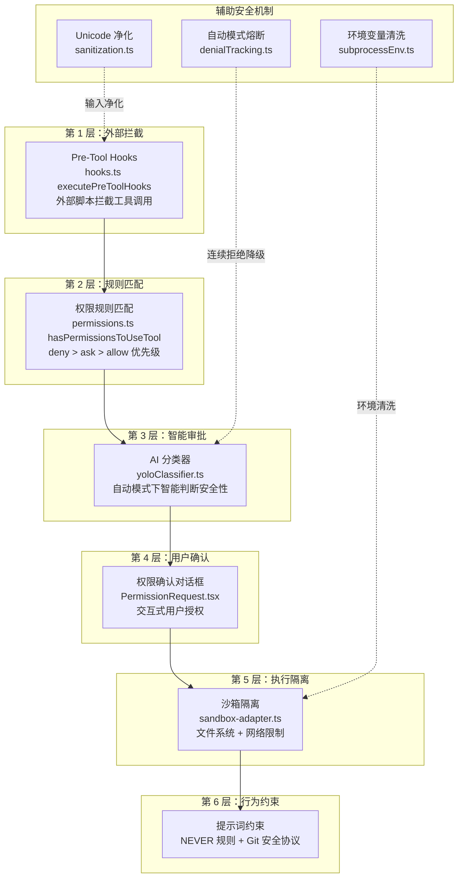
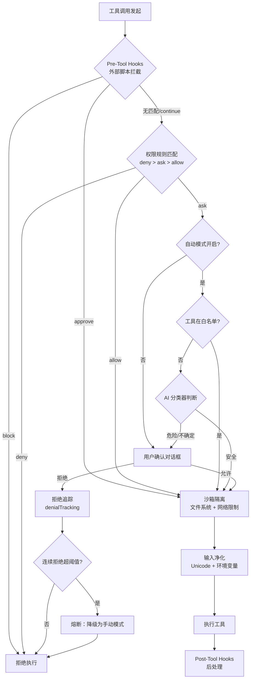

# 04 - 安全与权限

## 一、整体实现思路

Claude Code 的安全体系遵循"**安全是架构的一部分，而非事后补丁**"的设计理念。整个系统构建了 **6 层纵深防御体系**，从外部钩子拦截到内部提示词约束，层层递进、互为兜底。任何一层被突破，下一层仍然能够阻止危险操作。

核心思想：
- **纵深防御**：不依赖单一安全机制，6 层防线覆盖从工具调用到最终执行的全链路
- **最小权限**：默认拒绝，显式授权；沙箱限制文件和网络访问范围
- **智能审批**：自动模式下 AI 分类器判断操作安全性，兼顾效率与安全
- **熔断降级**：连续拒绝自动降级为手动模式，防止 AI 失控循环
- **输入净化**：从 Unicode 隐藏字符到环境变量，全方位防御注入攻击

## 二、模块架构图



## 三、细分功能实现

### 3.1 Pre-Tool Hooks 拦截

Pre-Tool Hooks 是安全体系的第一道防线，允许外部脚本在工具执行前拦截和修改操作。

**核心函数**：`hooks.ts` 中的 `executePreToolHooks`

**工作机制**：
- 工具调用发起时，系统先查找所有匹配的 `PreToolUse` 钩子
- 钩子可以返回 `decision: 'block'` 直接拒绝，或 `decision: 'approve'` 直接放行
- 钩子还可以通过 `updatedInput` 修改工具输入参数，或通过 `additionalContext` 注入额外上下文
- 支持命令行脚本、HTTP webhook、内部回调三种执行方式

**典型场景**：企业环境中通过钩子脚本强制执行安全策略，如禁止访问特定目录或执行特定命令。

### 3.2 权限规则匹配

权限规则匹配是安全体系的核心决策层，约 1500 行代码。

**核心函数**：`permissions.ts` 中的 `hasPermissionsToUseTool`

**规则结构**：
```typescript
type PermissionRule = {
  toolName: string        // 工具名，如 "Bash"
  ruleContent: string     // 规则内容，如 "Bash(git status:*)"
  behavior: 'allow' | 'deny' | 'ask'
  source: SettingSource   // 来源：user / project / managed
}
```

**优先级机制**：`deny > ask > allow`
- 如果任何规则匹配到 `deny`，直接拒绝，不再检查其他规则
- 如果匹配到 `ask`，需要用户确认
- 只有所有匹配规则都是 `allow` 时才自动放行

**权限模式**：

| 模式 | 行为 |
|------|------|
| `default` | 每次工具调用都需要用户确认 |
| `auto` | AI 分类器自动审批安全操作 |
| `plan` | 只允许只读工具，写入需确认 |
| `bypassPermissions` | 跳过所有权限检查（危险） |

### 3.3 AI 分类器自动审批

自动模式下，AI 分类器替代用户做出安全判断。

**核心文件**：`yoloClassifier.ts`

**工作流程**：
1. 接收工具名称和输入参数
2. 检查工具是否在预定义白名单中（如只读工具直接放行）
3. 对非白名单工具，调用轻量级 AI 模型（Haiku）判断操作安全性
4. 返回三种结果：安全（自动批准）、危险（需用户确认）、不确定（需用户确认）

**安全边界**：分类器只能"放行"或"上报"，不能覆盖 `deny` 规则的决策。

### 3.4 用户确认对话框

当前三层都无法自动决策时，系统弹出交互式确认对话框。

**核心组件**：`PermissionRequest.tsx`

**功能特性**：
- 显示工具名称、操作内容、风险说明
- 支持"允许一次"、"始终允许"、"拒绝"三种选择
- "始终允许"会将规则写入用户配置，后续同类操作自动放行
- 支持超时自动拒绝（防止无人值守时阻塞）

### 3.5 沙箱隔离

即使操作被批准，沙箱仍然限制实际执行的范围。

**核心文件**：`sandbox-adapter.ts`

**文件系统限制**：
```
读取：拒绝列表（/etc/shadow、~/.ssh/* 等敏感路径）
写入：允许列表（仅 $CWD 和 $TMPDIR）+ 拒绝列表（.env、credentials.json）
```

**网络限制**：
```
允许列表：github.com、api.anthropic.com 等
拒绝列表：*.internal 等内部域名
```

**实现方式**：通过 `SandboxManager.wrapWithSandbox` 在子进程执行前注入限制参数。

### 3.6 提示词约束

最后一层防线，通过系统提示词约束 AI 的行为意图。

**关键规则**：
- `NEVER` 规则：明确禁止的操作列表（如"NEVER execute commands that could harm the system"）
- Git 安全协议：提交前必须检查 diff、不自动 push 到 main 分支
- 工具使用指导：每个工具的提示词中包含安全使用说明

**设计理念**：提示词约束是"软防线"，依赖 AI 的遵从性，但与前 5 层"硬防线"配合形成完整的防御体系。

### 3.7 自动模式熔断

防止自动模式下 AI 陷入"反复尝试被拒绝"的死循环。

**核心文件**：`denialTracking.ts`

**熔断机制**：
- 追踪连续被拒绝的次数
- 当连续拒绝超过阈值时，自动从 `auto` 模式降级为 `default`（手动）模式
- 降级后需要用户手动恢复自动模式
- 防止 AI 在权限不足时无限重试，浪费 Token 和时间

### 3.8 Unicode 安全净化

防御 ASCII Smuggling 和隐藏提示词注入攻击。

**核心文件**：`sanitization.ts`

**净化流程**：
```typescript
function partiallySanitizeUnicode(prompt: string): string {
  // 1. NFKC 规范化（统一等价字符）
  current = current.normalize('NFKC')
  // 2. 移除危险 Unicode 类别（格式字符、私用区、未分配码点）
  current = current.replace(/[\p{Cf}\p{Co}\p{Cn}]/gu, '')
  // 3. 移除零宽字符、方向控制字符
  current = current.replace(/[\u200B-\u200F]/g, '')
  // 迭代直到稳定（最多 10 次，防止规范化产生新的危险字符）
}
```

**防御目标**：攻击者可能在看似正常的文本中嵌入不可见的 Unicode 字符，诱导 AI 执行隐藏指令。

### 3.9 子进程环境变量清洗

在 CI/CD 环境（如 GitHub Actions）中，清洗子进程可能继承的敏感环境变量。

**核心文件**：`subprocessEnv.ts`

**清洗列表**：
```typescript
const GHA_SUBPROCESS_SCRUB = [
  'ANTHROPIC_API_KEY',
  'AWS_SECRET_ACCESS_KEY',
  'ACTIONS_ID_TOKEN_REQUEST_TOKEN',
  'GITHUB_TOKEN',
  // ... 20+ 个敏感变量
]
```

**工作原理**：在 `spawn` 子进程时，从环境变量中移除敏感项，防止 AI 执行的命令意外泄露密钥。

### 权限检查完整流程图



## 四、学习要点

1. **纵深防御是核心理念** — 6 层防线不是冗余，而是互为兜底，任何单层被突破都有下一层保护
2. **deny > ask > allow 优先级** — 权限规则的匹配顺序确保安全策略不会被宽松规则覆盖
3. **自动模式有熔断机制** — 连续拒绝自动降级，防止 AI 在权限不足时无限重试
4. **提示词也是安全策略** — NEVER 规则和 Git 安全协议是"软防线"，与"硬防线"配合使用
5. **Unicode 净化防御隐藏攻击** — 迭代规范化直到稳定，防止攻击者利用不可见字符注入指令
6. **环境变量清洗防止密钥泄露** — 在 CI/CD 场景下尤为重要，子进程不应继承敏感凭证
