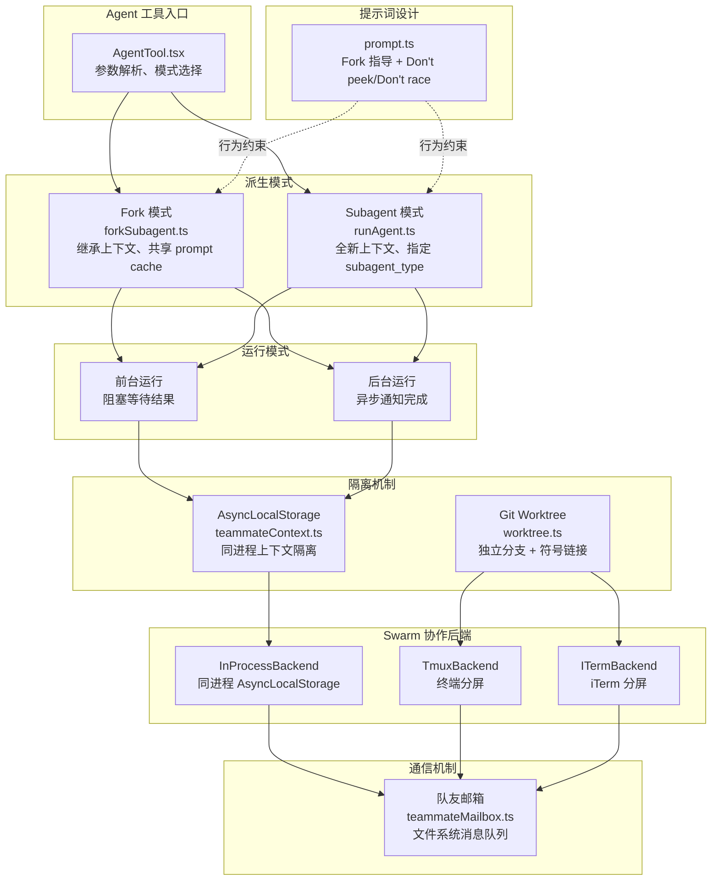
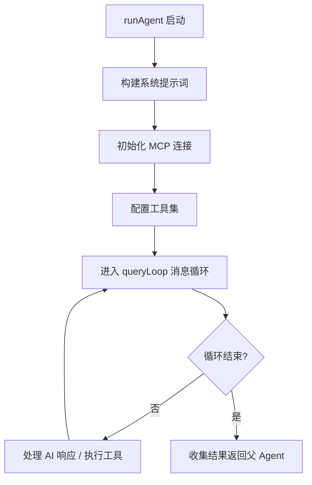
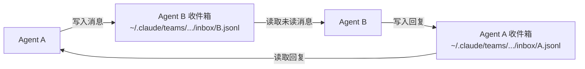
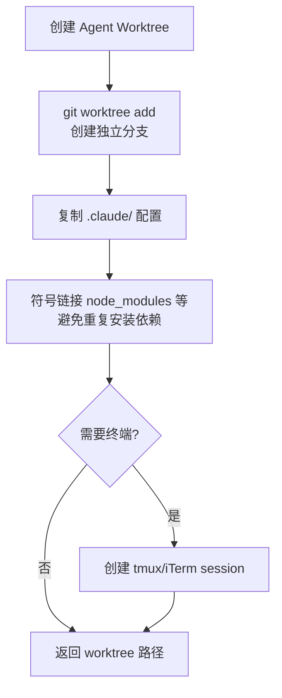
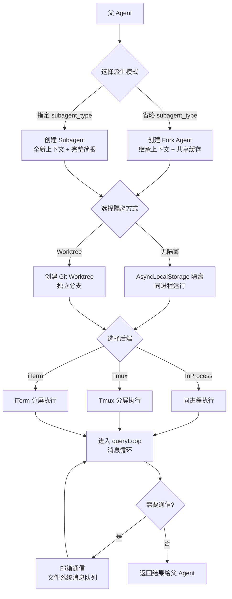

# 05 - 多 Agent 系统

## 一、整体实现思路

Claude Code 的多 Agent 系统体现了从"单 Agent 独立工作"到"多 Agent 协作完成复杂任务"的演进。系统提供了三种核心模式：**Fork**（继承上下文的轻量派生）、**Subagent**（全新上下文的独立任务）、**Teammate**（基于 Swarm 的多终端协作），覆盖了从简单子任务到复杂并行开发的全部场景。

核心设计思想：
- **按需隔离**：Fork 共享上下文降低成本，Subagent 独立上下文保证纯净，Worktree 提供 Git 级别的代码隔离
- **并发安全**：通过 AsyncLocalStorage 实现同进程内多 Agent 的上下文隔离，避免状态污染
- **松耦合通信**：队友间通过文件系统邮箱通信，简单可靠，不依赖复杂的 IPC 机制
- **多后端适配**：Swarm 支持 In-Process、Tmux、iTerm 三种后端，适配不同终端环境

## 二、模块架构图



## 三、细分功能实现

### 3.1 AgentTool 主实现

`AgentTool.tsx` 是多 Agent 系统的统一入口，负责参数解析和模式路由。

**核心逻辑**：
- 解析用户请求中的 `prompt`（任务描述）和 `subagent_type`（Agent 类型）
- 根据是否指定 `subagent_type` 决定使用 Fork 还是 Subagent 模式
- 省略 `subagent_type` → Fork 模式（继承上下文）
- 指定 `subagent_type` → Subagent 模式（全新上下文，可指定专用工具集）
- 支持前台（阻塞等待）和后台（异步通知）两种运行方式

### 3.2 runAgent 执行逻辑

`runAgent.ts` 是 Agent 实际执行的核心，负责构建运行环境并驱动消息循环。

**执行步骤**：
1. 构建系统提示词（根据 Agent 类型定制）
2. 初始化 MCP 连接（如果 Agent 需要外部工具）
3. 配置可用工具集（可限制为子集）
4. 进入消息循环（复用 queryLoop 核心引擎）
5. 收集执行结果返回给父 Agent



### 3.3 Fork 模式

Fork 是最轻量的 Agent 派生方式，适合"不需要结果出现在主上下文中"的子任务。

**核心文件**：`forkSubagent.ts`

**关键特性**：

| 特性 | 说明 |
|------|------|
| 上下文继承 | 完整继承父 Agent 的消息历史和系统提示词 |
| Prompt Cache 共享 | 复用父 Agent 的缓存，大幅降低 API 成本 |
| 指令式任务 | 只需告诉"做什么"，不需要提供完整背景 |
| 适用场景 | 研究问题、实现子功能、后台记忆提取 |

### 3.4 Subagent 模式

Subagent 以全新上下文启动，适合需要独立工具集或完整简报的任务。

**关键特性**：

| 特性 | 说明 |
|------|------|
| 全新上下文 | 不继承父 Agent 的消息历史 |
| 指定 subagent_type | 可选择专用 Agent 类型（如 code_review、research） |
| 完整简报 | 需要提供背景信息 + 任务描述 |
| 独立缓存 | 不共享父 Agent 的 prompt cache |

### 3.5 AsyncLocalStorage 隔离

解决同进程内多个 Agent 并发运行时的上下文隔离问题。

**核心文件**：`teammateContext.ts`

```typescript
const teammateContextStorage = new AsyncLocalStorage<TeammateContext>()

// 每个 Agent 在独立的 ALS 上下文中运行
function runWithTeammateContext<T>(context: TeammateContext, fn: () => T): T {
  return teammateContextStorage.run(context, fn)
}

// 任何代码路径都可以获取当前 Agent 的身份
function getTeammateContext(): TeammateContext | undefined {
  return teammateContextStorage.getStore()
}
```

**设计优势**：利用 Node.js 的 AsyncLocalStorage，无需显式传递上下文，异步调用链中自动继承，天然支持并发隔离。

### 3.6 Swarm 后端

Swarm 是多 Agent 协作的运行时后端，支持三种实现：

| 后端 | 实现方式 | 适用场景 |
|------|---------|---------|
| InProcessBackend | 同进程 + AsyncLocalStorage | 默认模式，资源开销最小 |
| TmuxBackend | tmux 终端分屏 | 需要可视化多 Agent 工作状态 |
| ITermBackend | iTerm 分屏 | macOS iTerm 用户 |

**后端选择逻辑**：优先检测 iTerm → 检测 tmux → 回退到 InProcess。

### 3.7 队友邮箱通信

Agent 之间通过文件系统实现的消息队列进行通信。

**核心文件**：`teammateMailbox.ts`

**消息类型**：
```typescript
type MailboxMessage = 
  | IdleNotification      // 空闲通知
  | PermissionRequest     // 权限请求
  | PermissionResponse    // 权限响应
  | ShutdownRequest       // 关闭请求
  | PlanApprovalRequest   // 计划审批
  | TaskAssignment        // 任务分配
  | ModeSetRequest        // 模式设置
  | DirectMessage         // 直接消息
```

**存储路径**：`~/.claude/teams/{team}/inbox/{agent}.jsonl`



**设计优势**：基于文件系统，无需额外进程间通信机制；JSONL 格式支持增量追加；天然持久化，进程重启不丢失消息。

### 3.8 Worktree 隔离

为需要独立代码空间的 Agent 提供 Git 级别的隔离。

**核心文件**：`worktree.ts`

**创建流程**：


**清理机制**：Agent 完成任务后，自动清理 worktree 和关联的分支。

### 3.9 Agent 提示词设计

`prompt.ts` 中精心设计的提示词确保 Agent 行为正确。

**关键指令**：
- **Fork 指导**：告诉 Fork Agent 它继承了父上下文，应该直接执行任务而非重新收集信息
- **"Don't peek"**：禁止 Agent 读取其他 Agent 的工作目录，防止并发冲突
- **"Don't race"**：禁止 Agent 与其他 Agent 竞争同一资源（如同一文件）
- **结果格式**：要求 Agent 以结构化格式返回结果，便于父 Agent 解析

### Agent 派生和通信流程图



## 四、学习要点

1. **Fork vs Subagent 的选择** — Fork 共享缓存降低成本，适合子任务；Subagent 独立上下文，适合需要专用工具的独立任务
2. **AsyncLocalStorage 是并发隔离的关键** — 利用 Node.js 原生能力，无需显式传递上下文，异步链自动继承
3. **文件系统邮箱是最简单可靠的通信方式** — JSONL 增量追加，天然持久化，无需额外 IPC 机制
4. **Worktree 提供 Git 级别隔离** — 独立分支 + 符号链接共享依赖，兼顾隔离性和资源效率
5. **提示词约束防止并发冲突** — "Don't peek" 和 "Don't race" 规则从行为层面避免 Agent 间的资源竞争
