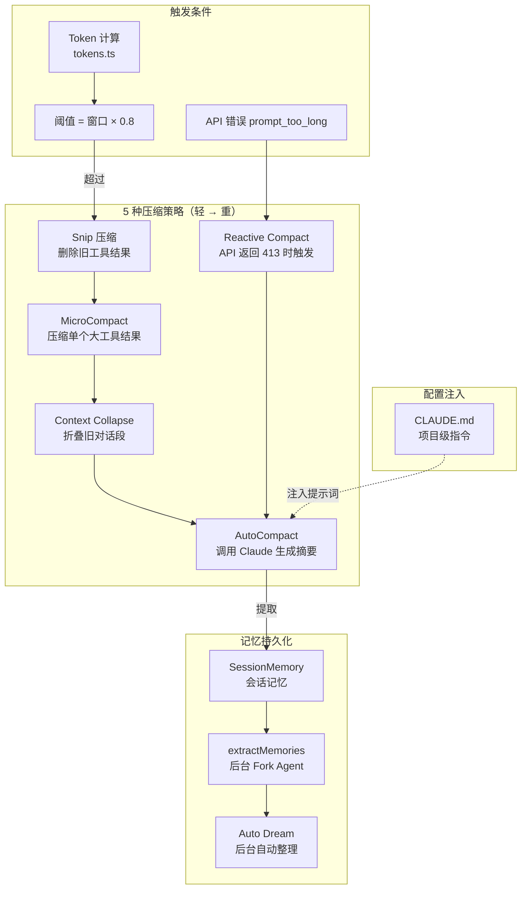
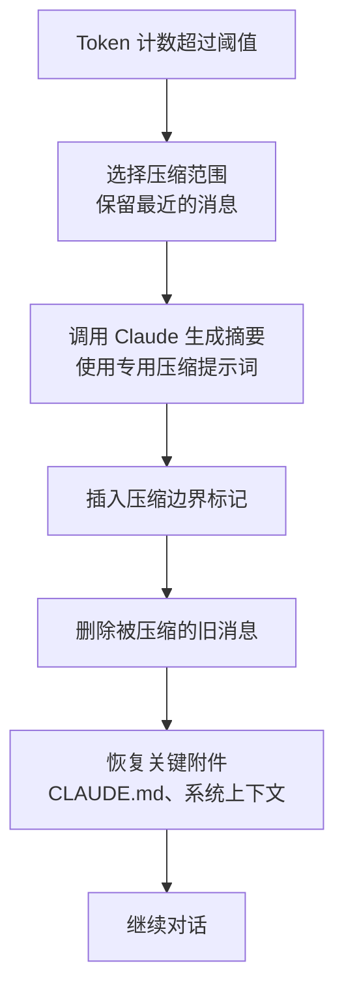
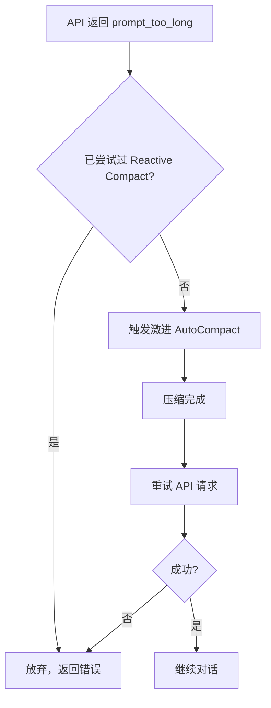
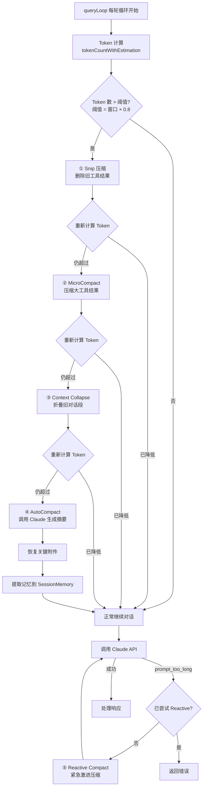

# 06 - 上下文管理

## 一、整体实现思路

LLM 的上下文窗口是有限的稀缺资源，Claude Code 通过**多种压缩策略 + 持久化记忆系统**智能管理上下文，确保在有限窗口内保留最有价值的信息。整个系统的设计理念是"**分层压缩、按需触发、记忆持久化**"：

- **分层压缩**：5 种压缩策略从轻量到重量依次触发
- **按需触发**：每种策略有明确的触发条件，不会过早压缩导致信息丢失
- **记忆持久化**：重要信息通过 SessionMemory 和 Auto Dream 提取到持久存储

核心挑战：在压缩信息和保留上下文之间找到平衡。

## 二、模块架构图



## 三、细分功能实现

### 3.1 Token 计算

Token 计算是所有压缩策略的基础，决定何时触发压缩。

**核心函数**：`tokens.ts` 中的 `tokenCountWithEstimation`

**计算逻辑**：
1. 找到最后一个有 `usage` 信息的 assistant 消息（API 返回的实际 Token 数）
2. 处理并行工具调用的消息分裂——同一个 `message.id` 可能对应多个交错的 `tool_result` 消息
3. 回退到第一个分裂消息，确保所有交错的 `tool_result` 都被估算
4. 最终结果 = `usage.input_tokens` + `cache_tokens` + `output_tokens` + 新消息估算

**消息分裂问题**：当 AI 同时调用多个工具时，API 返回一个 assistant 消息，但工具结果是多个独立的 user 消息。Token 计算必须正确处理这种交错结构。

### 3.2 AutoCompact

最核心的压缩策略，调用 Claude 生成对话摘要替换旧消息。

**核心文件**：`autoCompact.ts`

**触发条件**：
```typescript
function getAutoCompactThreshold(model: string): number {
  const contextWindow = getEffectiveContextWindowSize(model)
  return Math.floor(contextWindow * 0.8)  // 阈值 = 窗口 × 0.8
}
```

**执行流程**：



**压缩提示词**：要求 Claude 保留关键信息（文件路径、决策原因、未完成任务），丢弃冗余信息（重复的工具输出、探索性对话）。

### 3.3 MicroCompact

针对单个过大的工具结果进行局部压缩。

**核心文件**：`microCompact.ts`

**触发条件**：单个工具结果超过预设大小阈值。

**工作方式**：
- 不压缩整个对话，只压缩特定的工具结果
- 保留工具调用的元信息（工具名、参数），只压缩输出内容
- 使用轻量级模型（Haiku）执行压缩，降低成本

### 3.4 Snip 压缩

最轻量的压缩策略，直接删除旧的工具结果。

**工作方式**：
- 遍历消息列表，找到较早的工具结果消息
- 将工具结果替换为占位符（如 `[工具结果已删除]`）
- 保留工具调用信息，只删除输出
- 不调用 AI，零额外成本

### 3.5 Context Collapse

折叠旧的对话段，保留结构但压缩内容。

**工作方式**：
- 将连续的旧对话轮次折叠为摘要
- 保留每轮的关键信息（用户意图、AI 决策、工具调用）
- 删除详细的中间过程

### 3.6 Reactive Compact

API 返回 `prompt_too_long`（413）错误时的紧急压缩。



### 3.7 会话记忆

自动从对话中提取关键信息，持久化到文件系统。

**核心模块**：`SessionMemory`

**存储位置**：`~/.claude/memory/` 目录，每个记忆是独立的 `.md` 文件，带 frontmatter 元数据。

**提取时机**：AutoCompact 执行后、会话结束时、用户显式触发（`/remember` 命令）。

### 3.8 记忆提取

通过后台 Fork Agent 执行记忆提取任务。

**核心函数**：`extractMemories`

**提取提示词**：
```
你现在是记忆提取子代理。
分析最近的 ~N 条消息，更新持久化记忆系统。

可用工具：Read、Grep、Glob、只读 Bash、Edit/Write（仅限记忆目录）

你的轮次预算有限，高效策略：
- 第 1 轮：并行读取所有可能需要更新的文件
- 第 2 轮：并行写入/编辑所有变更
```

**安全限制**：记忆提取 Agent 只能读写 `~/.claude/memory/` 目录，不能修改项目代码。

### 3.9 Auto Dream

后台自动整理和优化记忆，类似人类睡眠时的记忆整合。

**核心文件**：`autoDream.ts`

**执行流程**：
1. 检查距上次整理的时间间隔（避免频繁触发）
2. 扫描最近的会话记录
3. 获取文件锁（防止多个进程并发整理）
4. 运行 Fork Agent 执行整理（合并重复、更新过时、删除无用）
5. 只允许只读 Bash 命令，确保安全

### 3.10 CLAUDE.md 配置

项目级指令注入，让 AI 了解项目特定的规范和约定。

**核心文件**：`claudemd.ts`

**加载层级**：
```
~/.claude/CLAUDE.md              → 用户级全局配置
$PROJECT_ROOT/CLAUDE.md          → 项目级配置
$PROJECT_ROOT/.claude/CLAUDE.md  → 项目级配置（备选路径）
```

**注入时机**：构建系统提示词时注入，作为 AI 的行为指导。

### 压缩决策流程图



## 四、学习要点

1. **5 种压缩策略互补而非互斥** — 从轻量到重量依次触发，每种解决不同粒度的问题
2. **Token 计算必须处理消息分裂** — 并行工具调用导致的交错消息结构是计算难点
3. **AutoCompact 阈值 = 窗口 × 0.8** — 留 20% 余量给新消息和系统提示词
4. **记忆提取是受限的 Fork Agent** — 只能读写记忆目录，不能修改项目代码
5. **Auto Dream 类似人类记忆整合** — 后台定期清理冗余和过时记忆
6. **CLAUDE.md 是项目级行为指导** — 多层级加载，注入系统提示词
