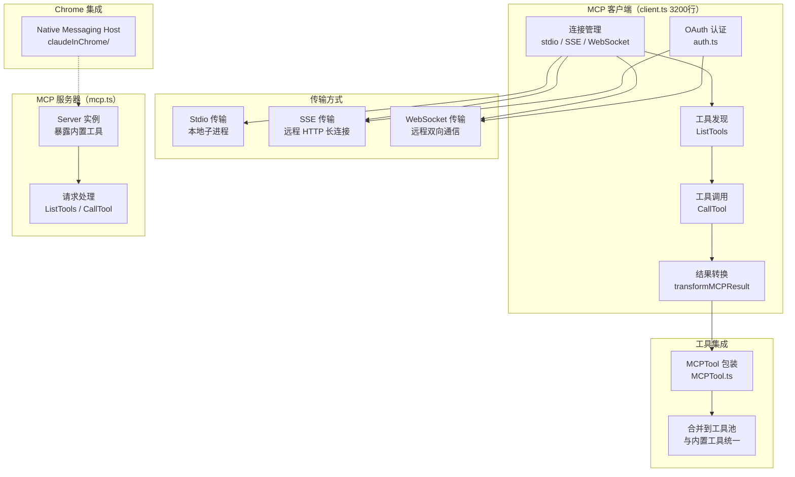
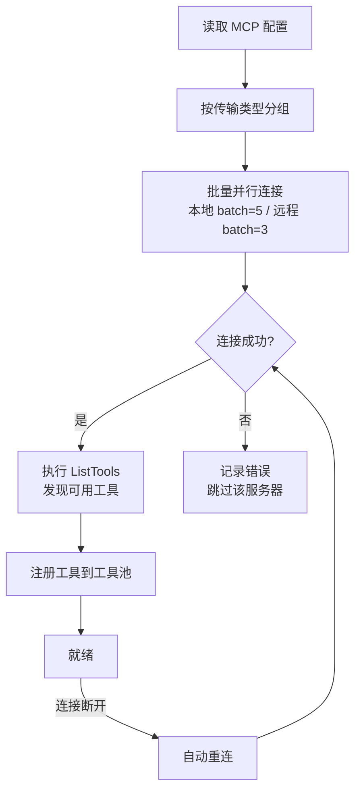
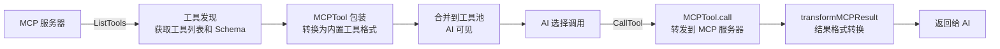
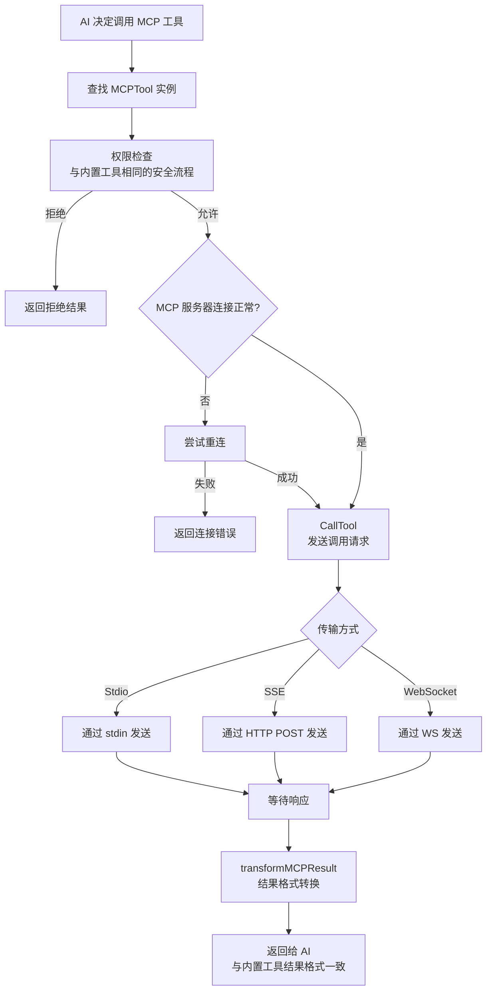

# 07 - MCP 协议

## 一、整体实现思路

MCP（Model Context Protocol）是标准化的 AI 工具扩展协议，Claude Code 同时实现了**客户端**和**服务器**两端。作为客户端，它可以连接外部 MCP 服务器获取额外工具能力；作为服务器，它可以将自身的 40+ 内置工具暴露给其他 MCP 客户端使用。

核心设计思想：
- **标准化接口**：工具发现（ListTools）和工具调用（CallTool）遵循统一协议，屏蔽底层传输差异
- **多传输支持**：stdio（本地进程）、SSE（远程 HTTP）、WebSocket 三种传输方式适配不同场景
- **透明集成**：外部 MCP 工具通过 MCPTool 包装后，与内置工具在 AI 视角完全一致
- **安全认证**：远程 MCP 服务器支持 OAuth 2.0 认证流程

## 二、模块架构图



## 三、细分功能实现

### 3.1 MCP 客户端

`client.ts` 是整个 MCP 系统的核心，约 3200 行，是项目中最大的单文件之一。

**核心职责**：
- 管理与多个 MCP 服务器的连接生命周期（连接、重连、断开）
- 执行工具发现和调用
- 处理认证流程
- 将 MCP 工具结果转换为内部格式

**连接批量管理**：
```typescript
// 本地和远程服务器分开批量连接，控制并发数
function getMcpServerConnectionBatchSize(): number { return 5 }
function getRemoteMcpServerConnectionBatchSize(): number { return 3 }

// 并行连接，但限制并发数
async function processBatched<T>(items, batchSize, fn) {
  for (let i = 0; i < items.length; i += batchSize) {
    await Promise.all(items.slice(i, i + batchSize).map(fn))
  }
}
```

### 3.2 连接管理

支持三种传输方式，适配不同的 MCP 服务器部署场景。

| 传输方式 | 协议 | 适用场景 |
|---------|------|---------|
| Stdio | 标准输入/输出 | 本地进程，如 Python/Node 脚本 |
| SSE | HTTP Server-Sent Events | 远程 HTTP 服务器 |
| WebSocket | WebSocket 双向通信 | 远程实时通信服务器 |

**连接生命周期**：



### 3.3 OAuth 认证

远程 MCP 服务器的 OAuth 2.0 认证流程。

**核心文件**：`auth.ts`

**认证流程**：
1. 客户端向 MCP 服务器请求认证端点
2. 打开浏览器引导用户授权
3. 接收回调获取授权码
4. 交换授权码获取 access_token
5. 后续请求携带 token

**支持的认证方式**：
- OAuth 2.0 标准流程（远程服务器）
- Claude.ai 代理认证（内置服务器）

### 3.4 工具发现和调用

标准化的工具生命周期：发现 → 包装 → 调用 → 转换。



**结果转换**：`transformMCPResult` 处理多种内容类型：
- 文本内容 → 直接返回
- 图片内容 → Base64 编码
- 二进制内容 → 保存到磁盘并返回路径

### 3.5 MCP 服务器模式

Claude Code 自身可作为 MCP 服务器，暴露内置工具给外部客户端。

**核心文件**：`entrypoints/mcp.ts`

**实现方式**：
```typescript
async function startMCPServer(cwd, debug, verbose) {
  const server = new Server({ name: 'claude/tengu', version: MACRO.VERSION })
  
  // 暴露所有内置工具
  server.setRequestHandler(ListToolsRequestSchema, async () => {
    const tools = getTools(emptyPermissionContext)
    return { tools: tools.map(tool => ({
      description: await tool.prompt({...}),
      inputSchema: zodToJsonSchema(tool.inputSchema),
    }))}
  })
  
  // 处理工具调用
  server.setRequestHandler(CallToolRequestSchema, async ({ params }) => {
    const tool = findToolByName(tools, params.name)
    const result = await tool.call(params.arguments, context)
    return { content: [{ type: 'text', text: JSON.stringify(result) }] }
  })
}
```

**应用场景**：其他 AI 工具或编辑器可以通过 MCP 协议调用 Claude Code 的文件操作、搜索、Git 等能力。

### 3.6 Chrome 集成

通过 Chrome Native Messaging Host 将 MCP 能力扩展到浏览器。

**核心目录**：`src/utils/claudeInChrome/`（7 文件）

**工作原理**：
- 安装 Native Messaging Host 到 Chrome
- Chrome 扩展通过 Native Messaging 与 Claude Code 通信
- Claude Code 作为 MCP 服务器处理来自浏览器的请求
- 支持浏览器检测和自动安装

### MCP 工具调用完整流程图



## 四、学习要点

1. **MCP 是双向的** — Claude Code 同时是客户端（使用外部工具）和服务器（暴露内置工具）
2. **三种传输方式适配不同场景** — Stdio 用于本地，SSE/WebSocket 用于远程
3. **MCPTool 包装实现透明集成** — 外部工具在 AI 视角与内置工具完全一致
4. **批量并行连接控制并发** — 本地 batch=5，远程 batch=3，避免资源耗尽
5. **结果转换处理多种内容类型** — 文本、图片、二进制都有对应的转换策略
