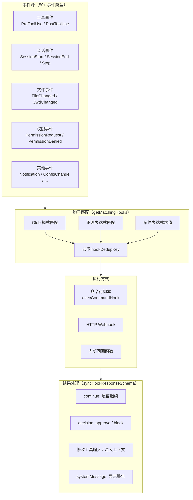
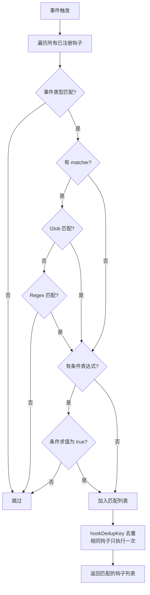
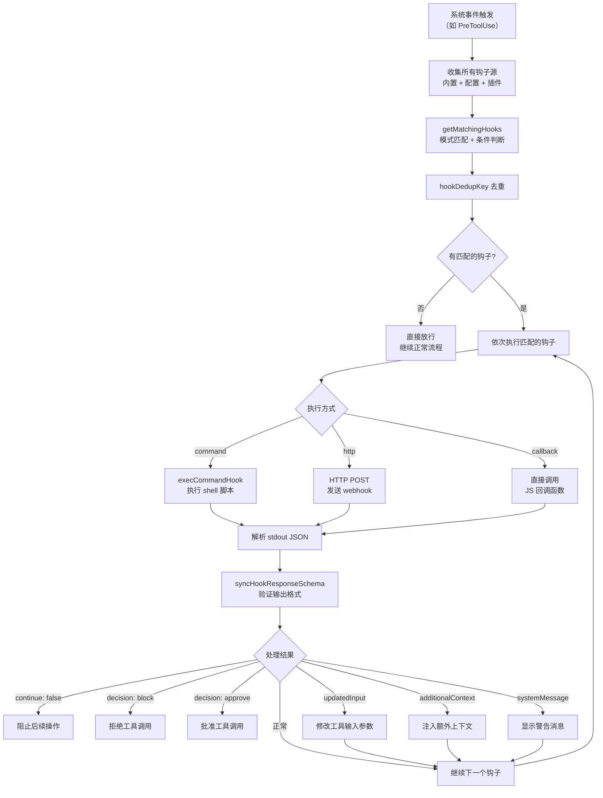

# 08 - 钩子系统

## 一、整体实现思路

钩子系统是 Claude Code 的**事件驱动可扩展性框架**，支持 50+ 种事件类型，允许外部脚本和内部回调在关键节点拦截、修改、扩展 AI 的行为。它的设计理念是"**不修改核心代码，通过事件订阅实现定制化**"。

核心设计思想：
- **事件驱动**：系统在关键操作点发出事件，钩子订阅感兴趣的事件
- **模式匹配**：通过 glob、regex、条件表达式灵活匹配目标事件
- **结构化输出**：钩子返回标准化的 JSON 结构，支持丰富的控制语义
- **多执行方式**：命令行脚本、HTTP webhook、内部回调三种方式适配不同场景

## 二、模块架构图



## 三、细分功能实现

### 3.1 事件类型全景

钩子系统覆盖了 Claude Code 运行过程中的所有关键节点：

| 事件类型 | 触发时机 | 典型用途 |
|---------|---------|---------|
| `PreToolUse` | 工具执行前 | 拦截危险操作、修改工具输入 |
| `PostToolUse` | 工具执行后 | 审计日志、结果后处理 |
| `PostToolUseFailure` | 工具执行失败后 | 错误监控、自动恢复 |
| `PermissionRequest` | 权限请求时 | 自定义审批逻辑 |
| `PermissionDenied` | 权限被拒绝时 | 拒绝统计、告警 |
| `SessionStart` | 会话开始 | 初始化、环境检查 |
| `SessionEnd` | 会话结束 | 清理、报告生成 |
| `Stop` | AI 停止响应 | 后处理、通知 |
| `UserPromptSubmit` | 用户提交消息 | 输入预处理、过滤 |
| `SubagentStart` | 子 Agent 启动 | Agent 监控 |
| `PreCompact` / `PostCompact` | 压缩前/后 | 压缩策略定制 |
| `FileChanged` | 文件变更 | 自动格式化、lint |
| `CwdChanged` | 工作目录变更 | 环境切换 |
| `ConfigChange` | 配置变更 | 配置同步 |
| `Notification` | 后台任务通知 | 桌面通知 |
| `Elicitation` | MCP 交互请求 | 用户输入收集 |
| `WorktreeCreate` | Worktree 创建 | Agent 隔离监控 |

### 3.2 钩子配置

钩子通过 JSON 格式配置，支持灵活的匹配规则。

```json
{
  "hooks": {
    "PreToolUse": [
      {
        "matcher": "Bash",
        "pattern": "rm -rf *",
        "type": "command",
        "command": "/path/to/safety-check.sh"
      }
    ],
    "SessionStart": [
      {
        "type": "command",
        "command": "echo '{\"hookSpecificOutput\":{\"hookEventName\":\"SessionStart\",\"initialUserMessage\":\"检查项目状态\"}}'"
      }
    ]
  }
}
```

**配置字段**：
- `matcher`：工具名匹配（用于 PreToolUse/PostToolUse）
- `pattern`：glob 或 regex 模式
- `type`：执行方式（command / http / callback）
- `command` / `url`：执行目标

### 3.3 钩子匹配

`getMatchingHooks` 函数负责从所有已注册的钩子中找到匹配当前事件的钩子。

**匹配流程**：



### 3.4 执行方式

三种执行方式适配不同的扩展场景：

| 方式 | 实现 | 适用场景 |
|------|------|---------|
| 命令行脚本 | `execCommandHook` 执行 shell 命令 | 本地脚本、CI/CD 集成 |
| HTTP Webhook | 发送 HTTP POST 请求 | 远程服务、微服务架构 |
| 内部回调 | 直接调用 JS 函数 | 插件系统、内置扩展 |

**命令行脚本执行**：
- 通过环境变量传递事件上下文（工具名、输入参数等）
- 脚本的 stdout 输出作为 JSON 解析
- 支持超时控制

### 3.5 输出 Schema

钩子返回结构化 JSON，通过 `syncHookResponseSchema` 验证。

```typescript
const syncHookResponseSchema = z.object({
  continue: z.boolean().optional(),        // 是否继续执行
  suppressOutput: z.boolean().optional(),   // 隐藏钩子输出
  stopReason: z.string().optional(),        // 停止原因
  decision: z.enum(['approve', 'block']).optional(),  // 权限决策
  reason: z.string().optional(),            // 决策原因
  systemMessage: z.string().optional(),     // 显示给用户的警告
  hookSpecificOutput: z.union([
    // PreToolUse 特有输出
    z.object({
      hookEventName: z.literal('PreToolUse'),
      permissionDecision: permissionBehaviorSchema().optional(),
      updatedInput: z.record(z.unknown()).optional(),
      additionalContext: z.string().optional(),
    }),
    // SessionStart 特有输出
    z.object({
      hookEventName: z.literal('SessionStart'),
      initialUserMessage: z.string().optional(),
      watchPaths: z.array(z.string()).optional(),
    }),
    // ... 更多事件类型
  ]).optional(),
})
```

### 3.6 PreToolUse 钩子

最强大的钩子类型，可以在工具执行前修改权限决策和工具输入。

**能力**：
- `permissionDecision`：覆盖权限系统的决策（approve / block）
- `updatedInput`：修改工具的输入参数（如修改文件路径、命令内容）
- `additionalContext`：注入额外上下文信息，影响 AI 后续行为

**典型场景**：
- 企业安全策略：禁止访问特定目录
- 代码规范：自动修正文件路径
- 审计：记录所有工具调用

### 3.7 SessionStart 钩子

会话开始时触发，用于初始化和环境配置。

**特有能力**：
- `initialUserMessage`：设置初始用户消息（自动开始任务）
- `watchPaths`：注册文件监听路径（文件变更时触发 FileChanged 事件）

**典型场景**：
- 自动检查项目状态
- 注册文件监听实现热重载
- 注入初始任务指令

### 3.8 插件钩子

从插件系统加载的钩子，扩展钩子的来源。

**核心函数**：`loadPluginHooks`

**加载流程**：
1. 扫描已安装的插件
2. 读取插件的 hooks 配置
3. 将插件钩子注册到全局钩子列表
4. 插件钩子与内置钩子统一匹配和执行

### 钩子执行完整流程图



## 四、学习要点

1. **钩子是最大的可扩展性入口** — 50+ 事件类型覆盖了 AI 工作流的所有关键节点
2. **三种执行方式适配不同场景** — 命令行脚本最灵活，HTTP webhook 适合远程，内部回调最高效
3. **PreToolUse 是最强大的钩子** — 可以修改权限决策和工具输入，实现深度定制
4. **结构化输出确保可控性** — Zod Schema 验证钩子返回值，防止格式错误导致系统异常
5. **去重机制防止重复执行** — hookDedupKey 确保相同钩子对同一事件只执行一次
