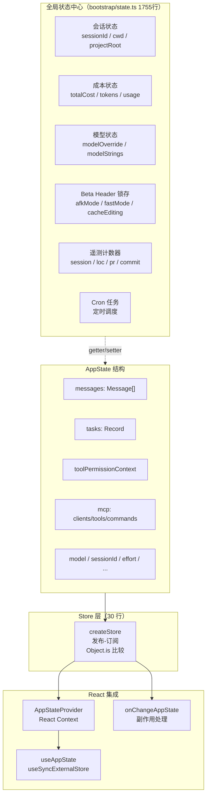
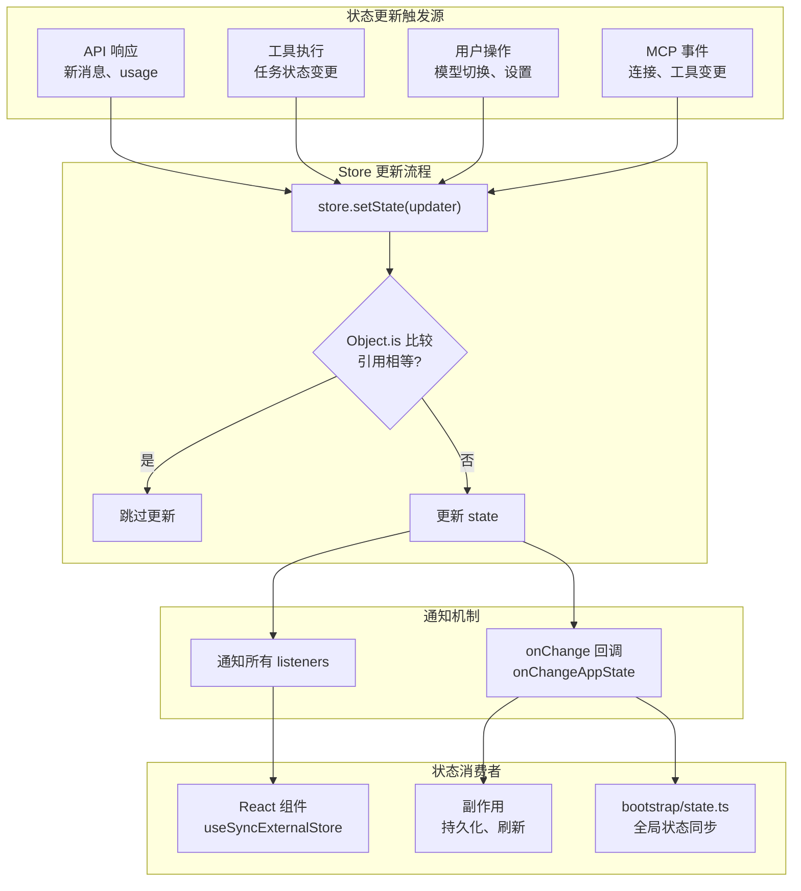

# 09 - 状态管理

## 一、整体实现思路

Claude Code 采用**轻量级自研 Store + 全局状态中心**的状态管理方案，刻意避免了 Redux 等重型框架。核心理念是"**够用就好**"——30 行代码实现完整的发布-订阅 Store，配合 React 的 `useSyncExternalStore` 实现 UI 同步，再通过 `bootstrap/state.ts` 管理所有非 React 的全局运行时状态。

设计决策：
- **极简 Store**：30 行实现发布-订阅，`Object.is` 比较避免无效更新
- **双轨状态**：React 状态通过 AppState Store 管理，非 React 状态通过 bootstrap/state.ts 的 getter/setter 管理
- **副作用分离**：状态变更的副作用通过 `onChangeAppState` 集中处理

## 二、模块架构图



## 三、细分功能实现

### 3.1 Store 实现

整个 Store 只有 30 行代码，实现了完整的发布-订阅模式。

```typescript
function createStore<T>(initialState: T, onChange?: OnChange<T>): Store<T> {
  let state = initialState
  const listeners = new Set<Listener>()
  return {
    getState: () => state,
    setState: (updater) => {
      const prev = state
      const next = updater(prev)
      if (Object.is(next, prev)) return  // 引用相等跳过
      state = next
      onChange?.({ newState: next, oldState: prev })
      for (const listener of listeners) listener()
    },
    subscribe: (listener) => {
      listeners.add(listener)
      return () => listeners.delete(listener)
    },
  }
}
```

**设计要点**：
- `Object.is` 比较：引用相等时跳过更新，避免无效渲染
- `onChange` 回调：状态变更时触发副作用
- `subscribe` 返回取消函数：符合 React `useSyncExternalStore` 的接口要求

### 3.2 AppState 结构

AppState 是 React 层的核心状态类型，包含 UI 渲染所需的所有数据。

```typescript
type AppState = {
  messages: Message[]                    // 对话消息列表
  tasks: Record<string, TaskState>       // 工具执行任务状态
  inProgressToolUseIDs: Set<string>      // 正在执行的工具 ID
  toolPermissionContext: ToolPermissionContext  // 权限上下文
  mcp: {
    clients: MCPClient[]                 // MCP 客户端列表
    tools: MCPTool[]                     // MCP 工具列表
    commands: MCPCommand[]               // MCP 命令列表
    resources: MCPResource[]             // MCP 资源列表
  }
  mainLoopModel: string                  // 当前主模型
  sessionId: string                      // 会话 ID
  effortValue: EffortValue               // 推理努力级别
  fastMode: boolean                      // 快速模式
  advisorModel?: string                  // 顾问模型
  standaloneAgentContext?: { name, color } // 独立 Agent 上下文
  fileHistory: { snapshots, trackedFiles } // 文件历史
  attribution: AttributionState          // 归因状态
}
```

### 3.3 React 集成

通过标准的 React Context + `useSyncExternalStore` 实现 UI 与 Store 的同步。

```typescript
// Provider：创建 Store 并通过 Context 传递
function AppStateProvider({ initialState, onChangeAppState, children }) {
  const store = createStore(initialState, onChangeAppState)
  return (
    <AppStateContext.Provider value={store}>
      {children}
    </AppStateContext.Provider>
  )
}

// Hook：使用 selector 订阅特定状态片段
function useAppState<T>(selector: (state: AppState) => T): T {
  const store = useAppStore()
  return useSyncExternalStore(
    store.subscribe,
    () => selector(store.getState())
  )
}
```

**性能优化**：`selector` 模式确保组件只在关心的状态片段变化时重渲染。

### 3.4 bootstrap/state.ts 全局状态中心

1755 行代码，管理所有非 React 的全局运行时状态，通过 100+ getter/setter 暴露。

**状态分类**：

| 类别 | 示例 getter/setter |
|------|-------------------|
| 会话 | `getSessionId()` / `regenerateSessionId()` / `getOriginalCwd()` / `getProjectRoot()` |
| 成本 | `getTotalCostUSD()` / `addToTotalSessionCost()` / `getTotalInputTokens()` |
| 模型 | `getMainLoopModelOverride()` / `setMainLoopModelOverride()` / `getModelStrings()` |
| Beta Header | `getAfkModeHeaderLatched()` / `setAfkModeHeaderLatched()` / `clearBetaHeaderLatches()` |
| 遥测计数器 | `getSessionCounter()` / `getLocCounter()` / `getPrCounter()` / `getCommitCounter()` |
| Cron | `getSessionCronTasks()` / `addSessionCronTask()` |

**设计理由**：这些状态不需要触发 React 渲染，放在 React 体系外可以避免不必要的重渲染开销。

### 3.5 onChangeAppState 副作用

状态变更时的集中副作用处理。

**典型副作用**：
- 消息列表变化 → 更新会话存储（持久化）
- 权限上下文变化 → 刷新工具可用性
- MCP 状态变化 → 更新工具池
- 模型变化 → 重新计算 Token 阈值

### 状态更新数据流



## 四、学习要点

1. **30 行 Store 够用就好** — 不需要 Redux 的复杂性，发布-订阅 + `Object.is` 比较足够
2. **双轨状态管理** — React 状态走 Store，非 React 状态走 bootstrap/state.ts，各司其职
3. **`useSyncExternalStore` 是桥梁** — 将外部 Store 与 React 渲染周期同步
4. **selector 模式优化性能** — 组件只订阅关心的状态片段，避免无关更新触发重渲染
5. **副作用集中处理** — onChangeAppState 统一管理状态变更的副作用，避免分散在各处
