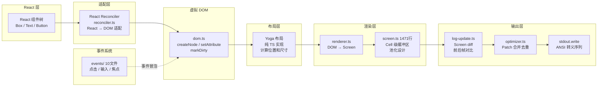
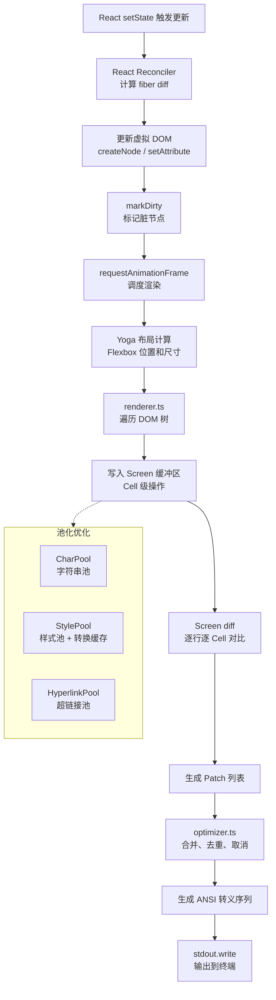

# 10 - 终端 UI 引擎

## 一、整体实现思路

Claude Code 内置了一个**完整的终端 UI 渲染引擎**（96 个文件），替代了外部 Ink 包。整个引擎实现了从 React 组件树到终端 ANSI 输出的完整渲染流水线：**React → 虚拟 DOM → Yoga 布局 → Screen 缓冲区 → diff → Patch → ANSI 输出**。

核心设计思想：
- **自主可控**：不依赖外部 Ink 包，完全掌控渲染行为和性能优化
- **纯 TS Yoga**：用纯 TypeScript 实现 Yoga 布局引擎，避免 C++ 原生绑定的跨平台编译问题
- **增量渲染**：Screen diff + Patch 优化，只更新变化的部分，减少终端闪烁
- **池化设计**：CharPool、StylePool、HyperlinkPool 减少内存分配和 GC 压力

## 二、模块架构图



## 三、细分功能实现

### 3.1 Ink 主类

`ink.tsx`（1664 行）是渲染引擎的核心控制器，管理整个渲染循环。

**核心职责**：
- 管理渲染循环（requestAnimationFrame 模式）
- 备用屏幕（Alternate Screen）切换
- 鼠标事件监听和分发
- 键盘输入处理
- 终端尺寸变化响应

### 3.2 虚拟 DOM

`dom.ts` 实现了轻量级的虚拟 DOM，作为 React 和布局引擎之间的桥梁。

**核心 API**：
- `createNode(tagName)`：创建 DOM 节点
- `setAttribute(node, key, value)`：设置属性
- `appendChild(parent, child)`：添加子节点
- `markDirty(node)`：标记节点需要重新渲染

### 3.3 React Reconciler

`reconciler.ts` 实现了 React 的自定义渲染器适配，将 React 的组件更新映射到虚拟 DOM 操作。

**适配接口**：React Reconciler 要求实现 `createInstance`、`appendChildToContainer`、`commitUpdate` 等方法，将 React 的 fiber 树变更转换为 DOM 操作。

### 3.4 Yoga 布局

用纯 TypeScript 实现的 Yoga 布局引擎，替代了 C++ 原生绑定。

**设计优势**：
- 无需编译原生模块，跨平台零配置
- 支持 Flexbox 布局模型（方向、对齐、换行、弹性伸缩）
- 与原版 Yoga 行为一致

```typescript
class YogaLayoutNode implements LayoutNode {
  insertChild(child, index): void
  removeChild(child): void
  calculateLayout(width?, height?): void
  getComputedWidth(): number
  getComputedHeight(): number
}
```

### 3.5 Screen 缓冲区

`screen.ts`（1471 行）实现了 Cell 级别的屏幕缓冲区，是渲染性能的关键。

**Cell 结构**：
```typescript
type Cell = {
  char: number       // 字符（池化索引）
  styleId: number    // 样式（池化索引）
  hyperlinkId: number // 超链接（池化索引）
  width: CellWidth   // 字符宽度（1 或 2）
}
```

**池化设计**：
- `CharPool`：字符串池，避免重复存储相同字符
- `StylePool`：样式池，相同样式共享同一个 ID，并缓存样式转换的 ANSI 序列
- `HyperlinkPool`：超链接池，相同 URL 共享同一个 ID

### 3.6 渲染器

`renderer.ts` 将虚拟 DOM 树渲染到 Screen 缓冲区。

**渲染过程**：遍历 DOM 树，根据 Yoga 计算的布局信息，将每个节点的内容写入 Screen 的对应位置。处理文本裁剪、边框绘制、背景填充等。

### 3.7 Screen diff

`log-update.ts` 实现前后帧的 Screen 对比，生成最小化的 Patch 列表。

**diff 算法**：逐行逐 Cell 对比前后两帧的 Screen 缓冲区，只记录变化的部分。相同的行直接跳过，变化的行生成对应的 Patch。

### 3.8 Patch 优化

`optimizer.ts` 对 diff 生成的 Patch 列表进行优化。

**优化策略**：
- **合并**：相邻的文本 Patch 合并为一个
- **去重**：重复的样式切换 Patch 去除
- **取消**：互相抵消的 Patch 对（如 cursorHide + cursorShow）移除

**Patch 类型**：
```typescript
type Patch =
  | { type: 'stdout'; content: string }        // 文本输出
  | { type: 'clear'; count: number }           // 清除行
  | { type: 'clearTerminal'; reason: string }  // 清屏
  | { type: 'cursorHide' | 'cursorShow' }      // 光标控制
  | { type: 'cursorMove'; x: number; y: number } // 光标移动
  | { type: 'styleStr'; str: string }          // 样式序列
  | { type: 'hyperlink'; uri: string }         // 超链接
```

### 3.9 事件系统

`events/` 目录（10 个文件）实现了完整的终端事件处理。

| 文件 | 功能 |
|------|------|
| `click-event.ts` | 鼠标点击（支持区域命中测试） |
| `input-event.ts` | 键盘输入（Key 解析、组合键） |
| `keyboard-event.ts` | 键盘事件分发 |
| `focus-event.ts` | 焦点管理（Tab 切换） |
| `terminal-focus-event.ts` | 终端窗口焦点 |
| `dispatcher.ts` | 事件分发（冒泡、优先级） |
| `emitter.ts` | 事件发射器 |

**事件冒泡**：点击事件从最内层节点向上冒泡，直到被处理或到达根节点。

### 3.10 文本选择

`selection.ts` 实现了终端中的文本选择功能。

**支持的操作**：
- 鼠标拖选：按住鼠标拖动选择文本区域
- 双击选词：双击自动选中一个单词
- 选中内容可复制到剪贴板

### 3.11 Unicode 宽度

`stringWidth.ts` 计算字符串在终端中的显示宽度。

**实现策略**：优先使用 `Bun.stringWidth`（Bun 运行时内置，性能最优），回退到自实现的 Unicode 宽度计算（处理 CJK 字符、Emoji 等双宽度字符）。

### 渲染流水线详细流程图



## 四、学习要点

1. **完整的渲染流水线** — 从 React 到 ANSI 输出，每一层职责清晰
2. **纯 TS Yoga 避免原生依赖** — 跨平台零配置，是务实的工程决策
3. **Screen diff + Patch 优化** — 增量渲染减少终端闪烁，提升用户体验
4. **池化设计减少内存压力** — CharPool、StylePool 避免重复分配，降低 GC 频率
5. **事件冒泡模型** — 借鉴浏览器 DOM 事件模型，在终端中实现了完整的事件处理
