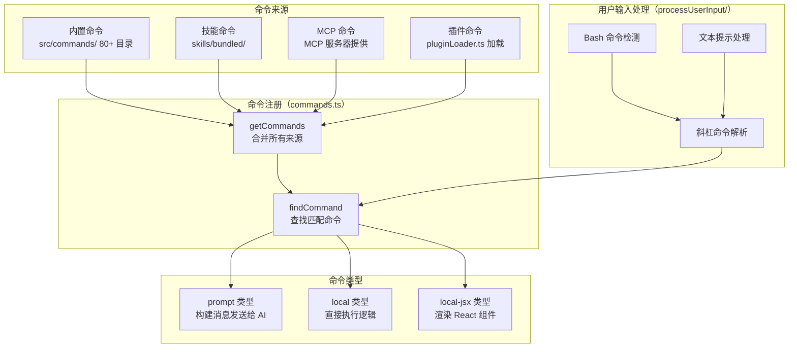
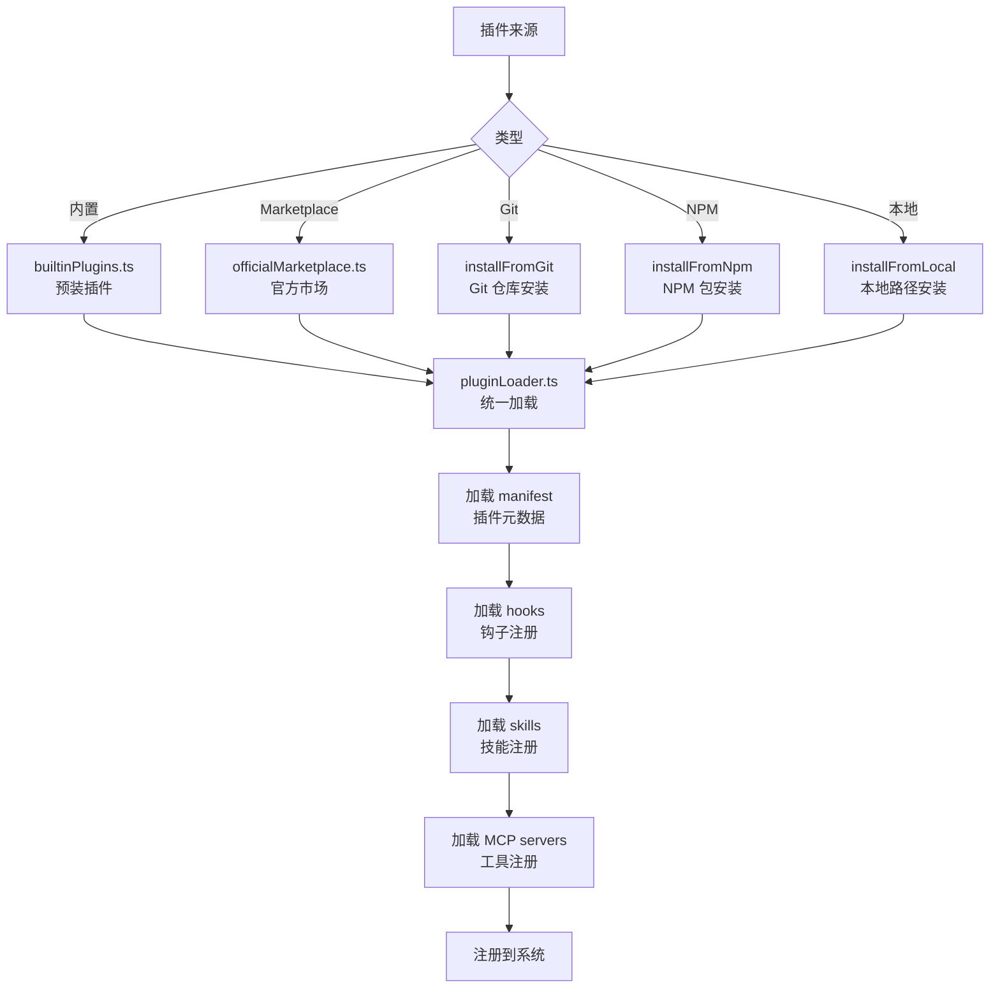
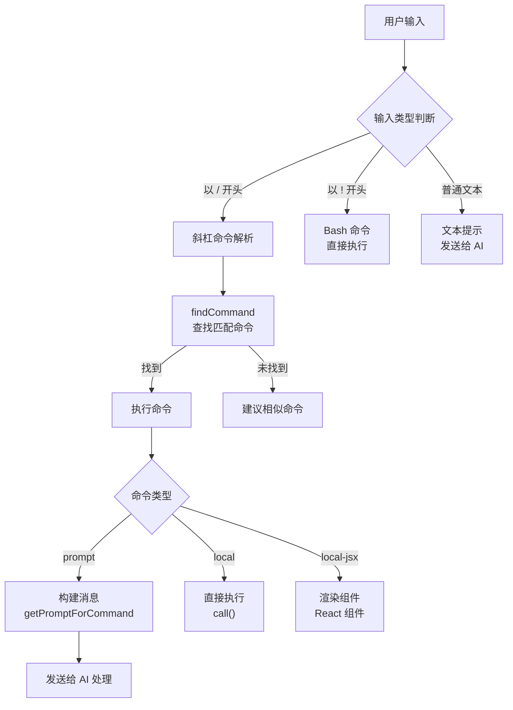

# 11 - 命令与技能

## 一、整体实现思路

Claude Code 提供了 **80+ 个斜杠命令 + 可扩展技能系统 + 插件系统**，构成了用户与 AI 交互的命令层。整个系统的设计理念是"**轻量入口、统一注册、多源合并**"：

- **轻量入口**：每个命令只是一个薄薄的入口层，实际逻辑委托给服务层或组件
- **统一注册**：内置命令、技能命令、MCP 命令、插件命令在运行时合并为统一的命令池
- **三种类型**：`prompt`（发送给 AI）、`local`（直接执行）、`local-jsx`（渲染 React 组件）

## 二、模块架构图



## 三、细分功能实现

### 3.1 命令类型

三种命令类型覆盖了不同的交互模式：

| 类型 | 执行方式 | 示例 |
|------|---------|------|
| `prompt` | 构建消息发送给 AI，AI 处理后返回结果 | `/commit`、`/review`、`/commit-push-pr` |
| `local` | 直接执行本地逻辑，不经过 AI | `/clear`、`/compact`、`/voice` |
| `local-jsx` | 渲染 React 组件（设置面板、选择器等） | `/config`、`/resume`、`/model`、`/permissions` |

```typescript
type Command = {
  type: 'prompt' | 'local' | 'local-jsx'
  name: string
  description: string
  allowedTools?: string[]       // prompt 类型：限制 AI 可用的工具
  source: 'builtin' | 'bundled' | 'plugin' | 'mcp'
  getPromptForCommand?(args, context): ContentBlockParam[]
  load?(): Promise<{ call: CommandCall }>
}
```

### 3.2 命令注册

`commands.ts` 中的 `getCommands` 函数负责合并所有来源的命令。

**合并顺序**：内置命令 → 技能命令 → MCP 命令 → 插件命令

**冲突处理**：同名命令按来源优先级覆盖（插件 > MCP > 技能 > 内置）。

**查找逻辑**：`findCommand` 支持前缀匹配，如 `/com` 可以匹配 `/commit`。

### 3.3 关键命令实现

**`/commit`**（prompt 类型）：
- 构建提示词让 AI 分析 git diff 并生成 commit message
- 限制工具为 `Bash(git add:*)` 和 `Bash(git commit:*)`
- 包含 Git 安全协议（不自动 push）

**`/commit-push-pr`**（prompt 类型）：
- 在 `/commit` 基础上增加 push 和创建 PR 的步骤
- 额外允许 `Bash(git push:*)` 和 `Bash(gh pr create:*)`

**`/clear`**（local 类型）：
- 清除当前对话消息
- 触发 SessionEnd 钩子
- 重置上下文状态

**`/resume`**（local-jsx 类型）：
- 渲染会话选择器组件
- 列出历史会话供用户选择
- 恢复选中会话的完整上下文

**`/branch`**（local-jsx 类型）：
- 从当前对话创建分支
- 保留分支点之前的所有消息
- 支持在不同分支间切换

### 3.4 技能系统

技能是可发现的命令，支持自动推荐和注册。

**核心目录**：`src/skills/bundled/`

**内置技能**：
```typescript
function initBundledSkills() {
  registerBatchSkill()          // /batch — 批量操作
  registerLoopSkill()           // /loop — 循环执行
  registerDebugSkill()          // /debug — 调试模式
  registerRememberSkill()       // /remember — 记忆管理
  registerKeybindingsSkill()    // /keybindings — 快捷键
  registerLoremIpsumSkill()     // /lorem-ipsum — 占位文本
  registerClaudeInChromeSkill() // /chrome — Chrome 集成
}
```

**技能 vs 命令**：技能本质上是命令，但额外支持自动发现和推荐（AI 可以主动建议使用某个技能）。

### 3.5 插件系统

`pluginLoader.ts`（3300 行）实现了完整的插件生命周期管理。

**插件来源**：



**版本管理**：支持语义化版本、自动更新检查、版本锁定。

### 3.6 用户输入处理

`processUserInput/` 目录负责解析用户的原始输入，路由到正确的处理逻辑。



## 四、学习要点

1. **命令是轻量入口** — 实际逻辑委托给服务层，命令本身只负责参数解析和路由
2. **prompt 类型命令最巧妙** — 通过构建提示词让 AI 执行复杂任务，同时限制可用工具确保安全
3. **四源合并统一命令池** — 内置 + 技能 + MCP + 插件在运行时合并，用户无感知
4. **插件系统支持多种安装方式** — Git、NPM、本地、Marketplace，覆盖不同分发场景
5. **输入处理三路分发** — 斜杠命令、Bash 命令、文本提示各走不同路径
