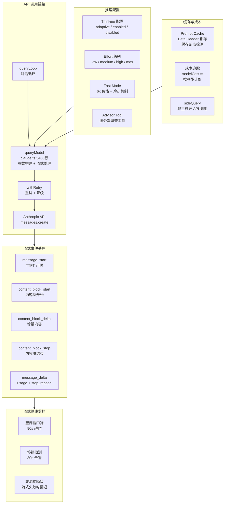
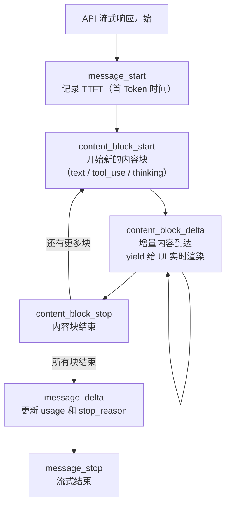
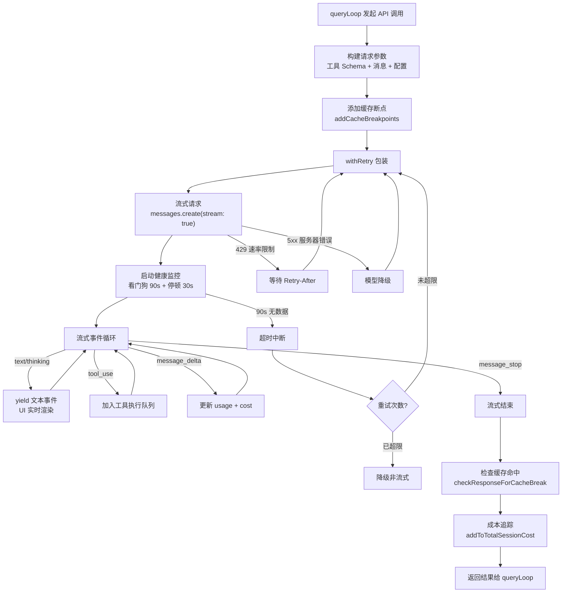

# 12 - API 通信层

## 一、整体实现思路

API 通信层是 Claude Code 与 Claude API 之间的桥梁，负责**流式交互、错误恢复、成本控制、缓存优化**的全链路管理。核心设计理念是"**流式优先、多层容错、成本可控**"：

- **流式优先**：默认使用流式 API，实时渲染 AI 响应，提升用户体验
- **多层容错**：流式健康监控 + 重试机制 + 模型降级 + 非流式回退，确保可靠性
- **成本可控**：Prompt Cache 优化降低重复输入成本，成本追踪实时监控开销
- **灵活配置**：Thinking/Effort/Fast Mode 等多维度控制 AI 的推理行为

## 二、模块架构图



## 三、细分功能实现

### 3.1 queryModel 核心

`claude.ts`（3400 行）是 API 通信的核心，负责构建请求参数和处理流式响应。

**核心流程**：
1. 工具 Schema 转换（`toolToAPISchema`）：将内部工具定义转换为 API 格式
2. 消息规范化（`normalizeMessagesForAPI`）：处理消息格式差异
3. 配置 thinking/effort/taskBudget 等推理参数
4. 添加缓存断点（`addCacheBreakpoints`）
5. 通过 `withRetry` 包装发起流式请求
6. 解析流式事件并 yield 给上层

### 3.2 流式事件处理

API 返回的流式事件按顺序处理：



### 3.3 流式健康监控

三层监控确保流式连接的可靠性：

| 监控层 | 阈值 | 行为 |
|--------|------|------|
| 空闲看门狗 | 90 秒无数据 | 中断连接，触发重试 |
| 停顿检测 | 30 秒无数据 | 显示告警，继续等待 |
| 非流式降级 | 流式连续失败 | 切换为非流式 API 调用 |

### 3.4 重试机制

`withRetry` 实现了智能重试和模型降级。

**重试策略**：
- 网络错误：指数退避重试
- 速率限制（429）：等待 Retry-After 后重试
- 服务器错误（5xx）：重试，可选降级到备用模型
- 模型不可用：自动切换到 fallback 模型

### 3.5 Thinking 配置

控制 AI 的思考过程可见性：

| 模式 | 说明 | 适用模型 |
|------|------|---------|
| `adaptive` | 自适应思考，AI 自行决定是否展示思考过程 | Opus 4.6、Sonnet 4.6 |
| `enabled` | 强制开启思考，指定预算 Token 数 | 旧模型 |
| `disabled` | 禁用思考过程 | 所有模型 |

```typescript
// 自适应思考
thinking = { type: 'adaptive' }
// 预算思考
thinking = { type: 'enabled', budget_tokens: min(maxOutput - 1, budget) }
```

### 3.6 Effort 级别

控制 AI 的推理深度：

```typescript
type EffortLevel = 'low' | 'medium' | 'high' | 'max'
// low → 快速简短回答
// medium → 默认平衡
// high → 深度思考
// max → 最大推理深度
// 通过 output_config.effort 传递给 API
```

### 3.7 Fast Mode

使用更快的推理路径，以更高价格换取更低延迟。

**定价**：Opus 4.6 Fast 模式 $30/$150 per Mtok（正常价格的 6 倍）

**冷却机制**：被 API 拒绝（如容量不足）后进入冷却期，冷却期内自动回退到正常模式。

### 3.8 Advisor Tool

服务端工具，让另一个 AI 模型审查主模型的工作。

```typescript
// 在 tools 数组中添加 advisor 工具
{ type: 'advisor_20260301', name: 'advisor', model: advisorModel }
// 主模型调用 advisor → 服务端转发给 advisor 模型 → 返回审查建议
```

**应用场景**：复杂任务中，主模型可以请求 advisor 模型提供第二意见。

### 3.9 Prompt Cache 优化

多种策略降低重复输入的 API 成本：

| 策略 | 说明 |
|------|------|
| Beta Header 锁存 | `setAfkModeHeaderLatched(true)` — 一旦发送，整个会话保持 |
| 缓存断点检测 | `checkResponseForCacheBreak()` — 监控 cache_read vs cache_creation |
| 全局缓存作用域 | `prompt_caching_scope` beta — 跨用户共享缓存 |
| Cached MicroCompact | `cache_edits` — 编辑缓存中的内容而非重建 |

### 3.10 成本追踪

`modelCost.ts` 按模型和 Token 类型计算 API 成本。

```typescript
const MODEL_COSTS = {
  'claude-opus-4-6':   { input: 5,  output: 25  },  // Fast: 30/150
  'claude-opus-4-5':   { input: 5,  output: 25  },
  'claude-opus-4':     { input: 15, output: 75  },
  'claude-sonnet-4-6': { input: 3,  output: 15  },
  'claude-sonnet-4':   { input: 3,  output: 15  },
  'claude-haiku-4-5':  { input: 1,  output: 5   },
  // 单位：$/Mtok
}
```

### 3.11 sideQuery

非主循环的 API 调用封装，用于辅助功能。

```typescript
await sideQuery({
  querySource: 'permission_explainer',
  model: 'haiku',
  system: SYSTEM_PROMPT,
  messages: [...],
  tools: [...],
  max_tokens: 1024,
})
```

**使用场景**：权限解释、会话搜索、模型验证、AI 分类器等不在主对话循环中的 API 调用。

### API 调用完整流程图



## 四、学习要点

1. **流式处理有三层健康监控** — 看门狗、停顿检测、非流式降级，确保连接可靠性
2. **Prompt Cache 直接影响成本** — Beta Header 锁存和缓存断点检测是关键优化手段
3. **重试机制支持模型降级** — 主模型不可用时自动切换到 fallback 模型
4. **Thinking/Effort/Fast Mode 三维控制** — 分别控制思考可见性、推理深度、推理速度
5. **sideQuery 封装辅助 API 调用** — 与主循环解耦，使用更轻量的模型降低成本
