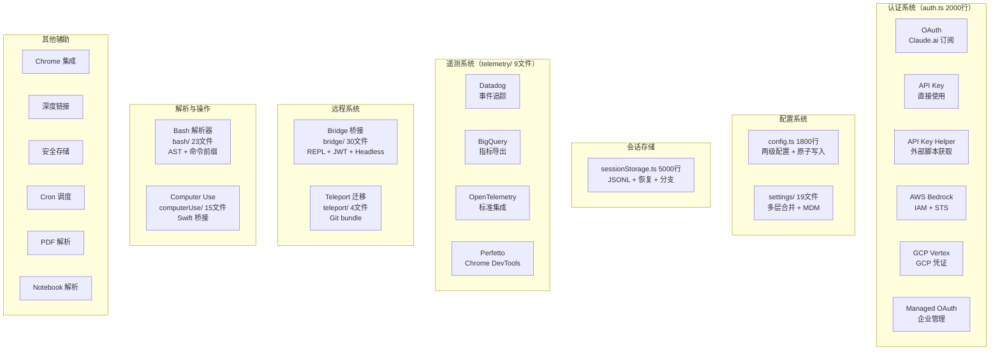

# 13 - 辅助系统

## 一、整体实现思路

辅助系统是支撑 Claude Code 核心功能运行的**基础设施层**，涵盖认证、配置、存储、遥测、远程桥接、跨机器迁移、命令解析、屏幕操作等多个子系统。虽然每个子系统相对独立，但它们共同构成了 Claude Code 可靠运行的基石。

核心设计思想：
- **多方式认证**：6 种认证方式覆盖个人用户、企业用户、云平台用户
- **多层配置**：用户级 + 项目级 + 企业管理级，原子写入保证一致性
- **持久化存储**：JSONL 格式的会话存储，支持恢复、分支、远程同步
- **可观测性**：多后端遥测系统，从 Datadog 到 Perfetto 全覆盖

## 二、模块架构图



## 三、细分功能实现

### 3.1 认证系统

`auth.ts`（2000 行）支持 6 种认证方式，覆盖所有使用场景。

| 认证方式 | 适用场景 | 说明 |
|---------|---------|------|
| OAuth | Claude.ai 订阅用户 | Max/Pro/Team/Enterprise 计划 |
| API Key | 开发者直接使用 | 通过环境变量或配置文件 |
| API Key Helper | 动态获取 Key | 外部脚本获取，支持 TTL 缓存 |
| AWS Bedrock | AWS 云用户 | IAM 认证 + STS 临时凭证 |
| GCP Vertex | GCP 云用户 | GCP 凭证认证 |
| Managed OAuth | 企业用户 | 企业管理的 OAuth 流程 |

**优先级**：OAuth > API Key > API Key Helper > Bedrock > Vertex

### 3.2 配置系统

`config.ts`（1800 行）实现了两级配置管理。

**配置层级**：
- `~/.claude/config.json` — 用户级全局配置
- `.claude/config.json` — 项目级配置

**关键特性**：
- **原子写入**：通过 lockfile 保护，防止并发写入导致配置损坏
- **备份恢复**：写入前自动备份，损坏时可恢复
- **配置迁移**：`migrateConfigFields` 处理版本升级时的配置格式变更
- **信任对话框**：`isPathTrusted` 首次打开项目时确认信任

### 3.3 设置系统

`settings/` 目录（19 文件）实现了多层设置合并。

**合并优先级**：
```
MDM（企业管理）> 用户设置 > 项目设置 > 默认值
```

**平台支持**：
- macOS：plist 文件
- Windows：注册表
- 通用：JSON 文件

### 3.4 会话存储

`sessionStorage.ts`（5000 行）管理对话会话的持久化。

**存储格式**：JSONL（每行一个 JSON 对象），支持增量追加。

**核心功能**：
- **会话恢复**（`/resume`）：从历史会话恢复完整上下文
- **会话分支**（`/branch`）：从某个时间点创建对话分支
- **远程同步**：支持与远程环境同步会话状态
- **子 Agent 独立 transcript**：每个子 Agent 有独立的会话记录

### 3.5 遥测系统

`telemetry/` 目录（9 文件）集成了多个遥测后端。

| 后端 | 用途 |
|------|------|
| Datadog | 事件追踪、错误监控 |
| BigQuery | 指标导出、数据分析 |
| OpenTelemetry | 标准化追踪集成 |
| Perfetto | Chrome DevTools 兼容的性能追踪 |

**追踪粒度**：支持 span 级别的会话追踪，可以精确到每个工具调用的耗时。

### 3.6 Bridge 远程桥接

`bridge/` 目录（30 文件）实现了本地终端与远程环境的桥接。

**核心组件**：
- **REPL Bridge**：本地终端 ↔ 远程环境的双向通信
- **Session Runner**：远程会话的生命周期管理
- **JWT 认证**：安全的远程连接认证
- **Headless 模式**：无 UI 的 CI/CD 集成模式
- **容量管理**：远程环境的容量监控和唤醒


### 3.7 Teleport 跨机器迁移

`teleport/` 目录（4 文件）实现了会话的跨机器迁移。

**迁移流程**：
1. 将当前代码打包为 Git bundle
2. 选择目标远程环境
3. 传输 Git bundle + 会话状态
4. 在目标环境恢复会话

**应用场景**：从本地开发环境迁移到远程服务器继续工作。

### 3.8 Bash 解析器

`bash/` 目录（23 文件）实现了完整的 Bash 命令解析。

**核心能力**：
- **AST 解析**：基于 tree-sitter 的语法树解析
- **命令前缀提取**：从复杂命令中提取主命令（用于权限匹配）
- **Heredoc 处理**：正确解析 heredoc 语法
- **管道重排**：分析管道中的命令序列
- **Shell 补全**：命令和路径的自动补全
- **安全分析**：检测潜在危险的命令模式

### 3.9 Computer Use

`computerUse/` 目录（15 文件）实现了屏幕操作能力（macOS）。

**实现方式**：通过 Swift 原生桥接调用 macOS 系统 API。

**核心功能**：
- 鼠标控制（移动、点击、拖拽）
- 键盘控制（按键、组合键、文本输入）
- 屏幕截图（全屏、区域）
- ESC 热键退出（安全机制）
- 沙箱锁（限制操作范围）

### 3.10 其他辅助模块

| 模块 | 文件 | 功能 |
|------|------|------|
| Chrome 集成 | `claudeInChrome/` 7文件 | Native Messaging Host、MCP 桥接 |
| 深度链接 | `deepLink/` | `claude://` 协议处理 |
| 安全存储 | `secureStorage/` | macOS Keychain 集成 |
| Cron 调度 | `cron.ts` | Cron 表达式解析和定时任务 |
| PDF 解析 | `pdf.ts` | PDF 读取和分页提取 |
| Notebook | `notebook.ts` | Jupyter Notebook 解析 |
| 语音 | `voice.ts` | 语音录制（Sox/arecord） |
| 虚拟宠物 | `buddy/companion.ts` | 确定性随机生成的虚拟宠物 |
| 迁移 | `migrations/` | 模型和配置的版本迁移 |

## 四、学习要点

1. **6 种认证方式覆盖全场景** — 从个人 API Key 到企业 Managed OAuth，优先级明确
2. **原子写入保证配置一致性** — lockfile + 备份恢复，防止并发写入损坏
3. **JSONL 格式适合增量追加** — 会话存储不需要重写整个文件，追加即可
4. **多后端遥测确保可观测性** — Datadog 监控 + BigQuery 分析 + Perfetto 性能追踪
5. **Bash 解析器是完整的编译器前端** — AST 解析 + 命令提取 + 安全分析，支撑权限系统的命令级控制
